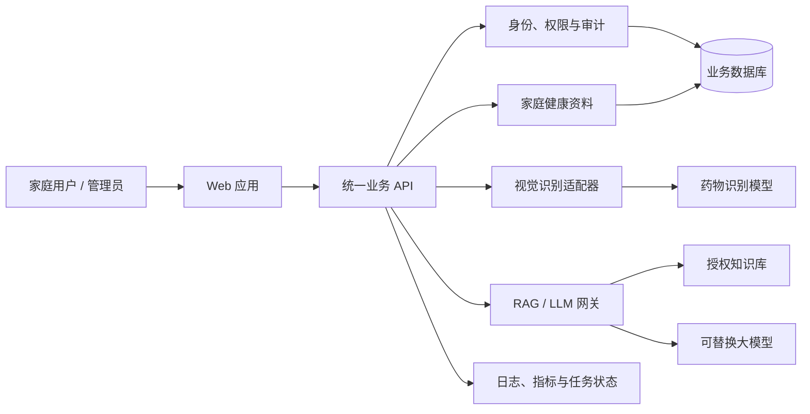

# 多模态智能医疗家庭助手

面向 8 周软件工程实训的多模态 AI 项目，计划通过药物图像识别、带引用的健康知识问答和家庭健康资料管理，辅助家庭成员更安全地获取和核对健康信息。

> **当前状态：启动准备阶段，尚未开始功能开发。**
>
> 本仓库目前主要包含需求、设计、计划和协作规范，没有可运行的完整系统。文档中的架构、接口、模型、目录和命令均为待评审候选方案，不代表已经实现。

> **使用边界：教学演示，不替代医疗诊断。**
>
> 项目不提供诊断、处方、药量调整或自动用药决策。出现紧急或高风险症状时，应立即联系医生或急救机构，不能依赖模型输出。

## 项目要解决什么问题

家庭健康场景中的信息通常分散在药品包装、检查报告、健康档案和不同知识来源中，普通用户还需要面对术语难懂、来源难核对和模型可能产生错误回答等问题。本项目计划验证一条受控的辅助链路：

1. 用户拍摄药品或上传相关图片，系统给出候选识别结果、置信度和人工核对提示；
2. 用户围绕药品、指标或健康知识提问，系统从授权资料中检索证据并生成带引用的回答；
3. 用户在明确授权下管理家庭成员的基础健康资料，系统按成员和权限隔离数据；
4. 管理员维护知识、模型版本和任务状态，并通过日志和评估证据追踪系统行为。

识别结果和问答内容只用于信息辅助。低置信度、证据不足、权限不明或高风险场景必须拒答、降级或提示人工处理。

## 目标用户与核心场景

| 用户            | 核心需求                               | 计划中的系统响应                         |
| --------------- | -------------------------------------- | ---------------------------------------- |
| 家庭普通用户    | 识别药品、查询健康知识、核对信息来源   | 返回候选结果、置信度、引用和安全提示     |
| 家庭健康管理者  | 管理家庭成员资料并查看历史健康事件     | 按授权访问、记录变更、支持导出和删除     |
| 知识/系统管理员 | 管理知识来源、模型版本、用户和服务状态 | 权限控制、版本追踪、审计和敏感操作确认   |
| 开发与测试成员  | 复现实验、验证功能并保留过程证据       | 固定测试集、自动检查、评审记录和追踪矩阵 |

## MVP 计划范围

| 模块       | MVP 目标                               | 不可突破的边界                       |
| ---------- | -------------------------------------- | ------------------------------------ |
| 药物识别   | 返回候选类别、边界框、置信度和模型版本 | 低置信度拒识别，不给出用药决定       |
| 医疗问答   | 支持文本/图片问答，回答附可定位来源    | 证据不足拒答，高风险症状提示立即就医 |
| RAG 知识库 | 授权资料入库、检索和引用               | 检索前鉴权，公共与个人知识域隔离     |
| 健康资料   | 管理家庭成员、过敏史、指标和健康事件   | 最小采集、加密、审计、可导出删除     |
| 管理后台   | 管理用户、知识、模型、任务和服务状态   | RBAC，敏感操作二次确认               |

一期不以临床使用、大规模线上运营、自动医疗决策或无限扩展病种/药品类别为目标。完整范围和验收条件见[需求规格说明书](docs/vibe-coding/01-需求规格说明书.md)。

## 计划架构



架构遵循“业务 API 统一入口、模型能力可替换、知识与个人数据隔离、关键行为可审计”的原则。各模块只能通过已评审契约协作，不允许前端直接访问模型、向量库或个人数据存储。详细边界见[系统架构与模块边界](docs/vibe-coding/04-系统架构与模块边界.md)。

## Vibe Coding 工作方式

本项目把 Vibe Coding 作为受约束的人机协作方法，而不是“描述想法后直接接受 AI 生成结果”。每个任务都执行同一闭环：

```text
需求与风险 -> Story/任务卡 -> 上下文包 -> AI 复述与计划 -> 人工确认
-> 小步实现 -> 自动验证 -> 人工评审 -> PR/验收 -> 证据归档
```

关键规则：

- 先定义用户价值、非目标、风险等级和可执行验收条件，再让 AI 参与；
- AI 先读取仓库事实并复述任务，计划经人确认后才进入实现；
- 每次只处理一个可验证增量，限制允许修改的文件和模块；
- 生成的代码、测试、文档和结论必须由责任人阅读、验证并签字负责；
- 医疗边界、数据授权、安全审批和最终验收不能交给 AI 决定；
- 高风险修改需要第二人复核，测试失败时不能通过删除校验或降低标准绕过；
- 每个“已完成”声明必须关联 PR、测试、评审或演示证据。

开始任务前，请阅读 [Vibe Coding 开发约束](docs/vibe-coding/03-Vibe-Coding开发约束.md)，并从 [AI 协作工作流与提示词模板](docs/vibe-coding/11-AI协作工作流与提示词模板.md)选择对应模板。

## 8 周实施路线

课程周期为 8 周、40 个工作日、320 学时。课程学习与项目研发采用双轨制：课堂练习用于掌握能力，项目 Story 必须另行经过需求、实现、测试、PR 和验收。

| 阶段      | 项目重点                                         | 里程碑证据                       |
| --------- | ------------------------------------------------ | -------------------------------- |
| 第 1 周   | 需求评审、数据分级、角色分工、环境与协作基线     | M0：启动就绪                     |
| 第 2 周   | 合成数据、实验追踪、API 契约和质量门禁           | M1：工程基线可实施               |
| 第 3-5 周 | 视觉数据治理、识别原型、unknown 类和药物单图 MVP | M2：受控视觉链路可演示           |
| 第 6-7 周 | Web 最小链路、上传安全、RAG、引用和 LLM 安全评估 | M3：带引用问答链路可演示         |
| 第 8 周   | 系统集成、回归、部署演练、文档、录屏和答辩       | M4：MVP 及其降级链路具备交付证据 |

如果数据许可、GPU、模型效果或时间不满足，应缩小类别和功能范围，或使用明确标注的模拟适配器；不得删除安全、测试和证据门禁。每日和每周安排见[八周迭代计划](docs/vibe-coding/10-八周迭代计划.md)。

## 当前阶段与启动条件

| 项目项             | 状态   | 进入下一状态所需证据                 |
| ------------------ | ------ | ------------------------------------ |
| 课程要求与需求基线 | 待评审 | 需求评审记录和范围确认               |
| 架构与技术选型     | 待验证 | 原型实验、ADR 和资源评估             |
| 开发环境与仓库规范 | 待建立 | 新成员可从干净环境复现               |
| 业务功能           | 未开始 | 需求、代码、测试和验收证据合并       |
| 视觉模型与数据集   | 未开始 | 数据卡、模型卡、固定评估集和基线报告 |
| RAG/LLM/微调       | 未开始 | 安全评估、引用评估和可回滚版本       |
| 部署与答辩材料     | 未开始 | 部署演练、测试报告、录屏和答辩验收   |

状态以[需求追踪矩阵](docs/vibe-coding/12-需求追踪矩阵.md)为唯一汇总入口。启动功能开发前必须完成：

1. 评审项目范围、非目标、医疗安全边界和数据来源；
2. 用小型原型验证高风险技术选型，记录 ADR 和退出条件；
3. 建立合成/公开授权数据、固定评估集和验收矩阵；
4. 验证开发环境、分支保护、PR 模板和双仓库同步；
5. 明确每个 Story 的负责人、复核人、风险等级和验收证据；
6. 通过[一期开发实施方案](docs/vibe-coding/16-一期开发实施方案.md)定义的启动就绪门禁。

因此，当前 README 不提供安装和启动命令。只有首个可运行基线经过合并与复现后，才会补充真实命令、依赖版本和已知限制。

## 团队分工

| 角色                | 主要责任                               | 必须接受的独立复核         |
| ------------------- | -------------------------------------- | -------------------------- |
| 项目经理/客户代表   | 范围、优先级、风险和验收               | 自己实现的高风险变更       |
| 模块设计师/开发     | 设计、实现、单元测试和技术文档         | 权限、医疗安全和跨模块契约 |
| 测试经理/测试工程师 | 测试计划、固定用例、回归和缺陷报告     | 验收标准变更               |
| 数据/算法负责人     | 数据卡、模型卡、实验、阈值和模型评估   | 数据发布和模型发布         |
| 文档经理/文档工程师 | 文档基线、需求追踪、评审记录和证据归档 | 无证据的状态变更不得通过   |

一人可以兼任多个角色，但认证授权、医疗安全规则、数据/模型发布和最终演示至少需要第二人复核。

## 候选技术基线

以下选型需要在第 1 周通过原型、资源评估和 ADR 确认：

- Web：Vue 3、TypeScript、Vite；
- API：Python 3.11、FastAPI；课程要求的 Flask 作为独立教学或管理端候选；
- 数据：PostgreSQL、ChromaDB、对象存储、Redis；
- AI：PyTorch、OpenCV、经复现实验确认的 YOLO、可替换 LLM 网关；
- RAG：优先保持薄编排层，确有需要时采用 LangChain；
- 测试：pytest、httpx、Playwright、模型固定回归集；
- 部署：Docker Compose；本地模型候选为 Ollama，GPU 服务按资源评估选择。

技术名称来自课程要求或当前候选方案，不等于最终决定。选型理由、替代方案和退出条件见[技术方案](docs/vibe-coding/02-技术方案.md)。

## 开始前必读

| 目的                | 文档                                                                |
| ------------------- | ------------------------------------------------------------------- |
| 了解全部文档和顺序  | [文档导航](docs/vibe-coding/00-文档导航.md)                         |
| 确认需求和验收边界  | [需求规格说明书](docs/vibe-coding/01-需求规格说明书.md)             |
| 按规则使用 AI       | [Vibe Coding 开发约束](docs/vibe-coding/03-Vibe-Coding开发约束.md)  |
| 领取和拆分任务      | [任务拆分与交付清单](docs/vibe-coding/15-任务拆分与交付清单.md)     |
| 填写 Story/评审证据 | [过程交付物与评审模板](docs/vibe-coding/17-过程交付物与评审模板.md) |
| 提交代码和文档      | [贡献指南](CONTRIBUTING.md)                                         |
| 配置双仓库自动同步  | [双仓库同步提交说明](双仓库同步提交说明.md)                         |

## 成熟方法参考

项目参考 NIST AI RMF 1.0、NIST AI 600-1、OWASP Top 10 for LLM Applications、WHO《Ethics and governance of artificial intelligence for health》，以及模型卡、数据卡、固定评估集、ADR、威胁建模和小批量 PR 等工程实践。

这些方法用于建立风险治理和验证框架，不代表项目已经取得医疗器械资质、通过合规认证或适合真实诊疗环境。参考链接和具体落地关系见[文档导航](docs/vibe-coding/00-文档导航.md)。

## 参与协作

- 从已评审的 Story 开始，不直接认领模糊的“大功能”；
- 一个 Story 对应一个主要负责人、一个主要 PR 和一组可验证证据；
- 分支、提交和 PR 引用需求编号，PR 中说明 AI 参与范围；
- 不提交密钥、真实医疗数据、模型权重、缓存或本地产物；
- 需求、架构、模型、数据、阈值、公开 API 和安全规则变化必须同步更新文档；
- 双仓库协作成员按[双仓库同步提交说明](双仓库同步提交说明.md)配置和验证同步流程。

具体提交、评审和双仓库协作要求见 [CONTRIBUTING.md](CONTRIBUTING.md)。
