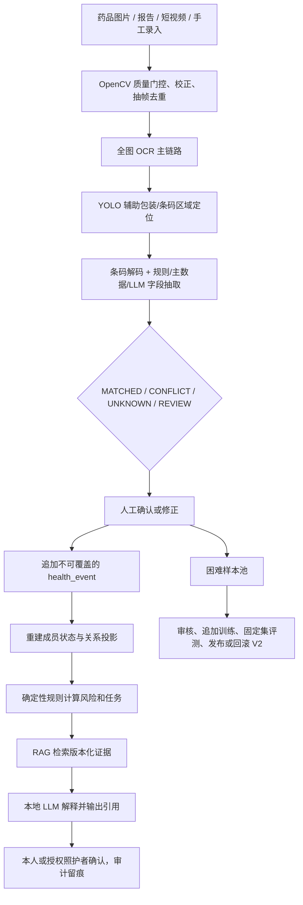
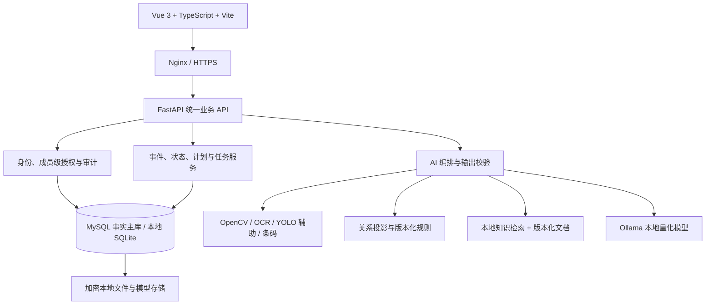

# 家健镜 HomeCare Twin

本地优先的家庭居家照护教学系统：把药品、过敏、指标和计划的变化写成不可覆盖的健康事件，用多证据视觉录入、确定性规则和受约束本地大模型，帮助家庭看清「发生了什么、依据是什么、下一步谁确认」。

> **产品硬承诺：** 健康数据默认不出网；药盒识别必须多渠道核对且支持人工修正；子女只能看到被精细授权的信息；提醒按等级和预算控制；AI 只能基于完整证据解释，不做诊断、处方或自主用药判断；不提供买药、问诊和广告导流。

> **使用边界：教学演示，不用于诊断或治疗。** 紧急情况请联系医务人员或当地急救服务。

## 当前状态

一期工程骨架、家庭/成员/授权、不可变事件、状态投影、规则与风险、视觉质量门控、OCR-first 证据、人工复核、本地知识检索和受约束助手接口已经进入本仓库，并有自动测试。

**完整 P0 业务仍未关闭：** 正式药品固定集、模型发布、三档部署演练和 R3 验收尚未完成。进度以[需求追踪矩阵](docs/vibe-coding/12-需求追踪矩阵.md)及可复现证据为准，不以 README、截图或本地实验冒充已交付。当前核心能力的机器验收入口见 [P0 核心能力验收包](docs/acceptance/HCT-P0-核心能力验收方案.md)。

产品界面是 `src/web` 的 Vue 应用（多套可切换主题，含「青黛映蓝」）。`src/web/react` 是风格与教学页面来源，不是第二套运行时。

## 快速开始：如何部署

需要 [Git](https://git-scm.com/)、[uv](https://docs.astral.sh/uv/)（Python 3.11）、[Node.js 22+](https://nodejs.org/) 和 [Docker Desktop](https://www.docker.com/products/docker-desktop/)（Compose 路径）。Windows 用 PowerShell，Linux/macOS 把 `scripts/start.ps1` 换成 `scripts/start.sh`。

更细的端口、探针、质量 Demo 和故障说明见[本地部署与 Demo 操作指南](docs/本地部署与Demo操作指南.md)。干净环境复现证据见 [HCT-101 记录](docs/reviews/HCT-101-工程骨架干净环境复现记录.md)。

### 路径 A：Docker Compose 基础档（推荐干净机器）

基础档启动 MySQL、FastAPI、outbox worker、care-plan worker（HCT-308 漏服升级/照护通知）和 Nginx 托管的 Vue 前端。Ollama 默认不启动，助手接口返回结构化降级，档案/事件/规则仍可用。

```powershell
git clone https://github.com/Meyt1n/issedu_ysu2026_3709.git
cd issedu_ysu2026_3709
# 视觉/助手闭环尚未合入 master 时，请用功能分支才能对齐当前演示代码
git switch feature/hct-local-model-adapter
Copy-Item .env.example .env
# 把 .env 里的 change-me 密码换成自己的本地口令，不要提交该文件

scripts/start.ps1 setup
scripts/start.ps1 up
scripts/start.ps1 health
```

| 入口 | 地址 |
|---|---|
| 成员前台（家人：人脸 / PIN） | http://localhost:8080 |
| 管理后台（管理员：账号密码） | http://localhost:8081 |
| API 健康检查 | http://localhost:8000/health |
| OpenAPI | http://localhost:8000/docs |

前台/后台是同一容器、同一构建产物的两个监听端口（HCT-453），共用同一个 API 和授权真相；账号与入口不匹配时会被登出并指引到另一入口。

开发身份：页面填写 Actor ID，或请求头 `X-Actor-ID`（仅 `ALLOW_DEV_ACTOR_HEADER=true` 时可用）。生产前必须换成真实认证。

端口冲突时改 `.env` 的 `API_PORT`、`WEB_PORT`、`ADMIN_WEB_PORT`、`MYSQL_PORT` 后重新 `up`。

```powershell
scripts/start.ps1 down          # 停服务，默认保留 mysql_data 卷
```

清空教学库必须由负责人显式执行 `docker compose --profile basic down --volumes` 并记录影响；标准 `down` 不会删卷。

增强档（额外启动本机 Ollama 容器）在启动前设置：

```powershell
$env:COMPOSE_PROFILE = "enhanced"
scripts/start.ps1 up
```

容器内的 Ollama 仍需自行 `ollama pull` / `ollama create` 模型；未配置 `OLLAMA_MODEL` 时助手保持降级。HCT-408 三档备份恢复仍在进行中，不能把增强档当成已验收交付。

### 路径 B：本地进程（调试 Vue / FastAPI）

适合改代码。不自动启动 outbox worker。默认 API 配置是 SQLite `./homecare-dev.sqlite3`；一旦存在 `.env`（`setup`/`up` 会从示例复制），`DATABASE_URL` 会指向 Compose 的 MySQL——没有 MySQL 时请改成 SQLite，或先只起数据库。

```powershell
scripts/start.ps1 setup
$env:DATABASE_URL = "sqlite+pysqlite:///./homecare-dev.sqlite3"
scripts/start.ps1 migrate

# 终端 1
scripts/start.ps1 api

# 终端 2（成员前台，或调试用单入口 scripts/start.ps1 web）
scripts/start.ps1 web-member

# 终端 3（可选：管理后台入口）
scripts/start.ps1 web-admin
```

| 入口 | 地址 |
|---|---|
| 成员前台（`web-member`） | http://127.0.0.1:5173 |
| 管理后台（`web-admin`） | http://127.0.0.1:5174 |
| 调试单入口（`web`，按账号角色进门户） | http://127.0.0.1:5173 |
| API | http://127.0.0.1:8000 |

两个前端进程共用同一个 API（HCT-453）。等价命令：`npm run dev:web:member` / `npm run dev:web:admin`，或 `HCT_WEB_PORT=5174 VITE_PORTAL_MODE=admin npm run dev:web`。

本机代理固定走 `127.0.0.1`，避免 `localhost` 解析到 IPv6。多人联调可设 `HCT_API_PROXY`（后端）、`HCT_WEB_PORT`（前台端口）和 `HCT_ADMIN_WEB_PORT`（后台端口）。

### 可选：复刻本机视觉与助手闭环

权重、PaddleOCR 环境和微调 GGUF **不进 Git**，别人必须在自己机器上准备，不要拷贝他人盘符或 SQLite。没有它们时，质量门控、建任务、人工复核和助手降级仍然可用。

要接近「扫合成药盒 → 复核入档 → 助手按事实回答」：

1. 用上面的路径 B 或 Compose 起 API/Web（默认端口 **8000 / 5173 或 8080**）。
2. 按 [视觉演示说明](docs/demo/vision-samples/README.md) 自备 PaddleOCR 环境、生成 `demo-cn-en-v1`、启动 `scripts/vision_worker.py`，上传本目录合成药盒。
3. 按 [本地大模型闭环](docs/demo/local-llm-v5.md) 在仓库外准备 Ollama 模型，设置 `OLLAMA_MODEL` 后重启 API；先在自己建的成员上确认一条用药再提问。
4. 若演示助手「朗读回答」或随身版长辈播报：先按 [中文语音包与听感准备说明](docs/demo/中文语音包与听感准备说明.md) 在本机安装 Natural 类中文 TTS；仓库不附带语音包，仅有机械默认音色时听感改善有限。

`VISION_ADAPTER_SIGNING_KEY` 必须与 worker 的 `HCT_ADAPTER_SIGNING_KEY` 相同（示例均为 `dev-only-change-me`）。v5 尚未完成正式评估，输出只用于教学演示。

### 可选：启用联网搜索与刷新知识库

两项能力默认关闭/受限。**按步骤启用请看专文：**

→ [联网搜索与知识库刷新启用指南](docs/demo/联网搜索与知识库刷新启用指南.md)

（环境说明亦可对照[本地部署与 Demo 操作指南 §4.2/§4.3](docs/本地部署与Demo操作指南.md)。）

**最短路径（课堂演示）：**

1. `.env` 写入并重启 API：

```dotenv
AGENT_WEB_SEARCH_ENABLED=true
AGENT_WEB_SEARCH_PROVIDER=fixture
```

2. 网页 Actor 填 `demo-parent` → 助手页勾选「补充联网参考」→ 提问。
3. 同一身份打开「知识文档」→「一键教学闭环：抓取 → 批准 → 晋升」→ 按页面提示做 dry-run 入库。

外部结果只作为「外部参考（非本地审核证据）」；爬虫**永不 auto_ingest**。
### 提交前检查

```powershell
scripts/start.ps1 check
```

等价于 Ruff、pytest、前端类型检查/构建和 Compose 配置校验。无法运行的检查要在 PR 里如实说明。

## 核心价值

家庭中的药品、检查报告、过敏史、指标、计划和照护关系经常分散且不断变化。家健镜将每次变化保存为不可覆盖的 `health_event`，再重建当前状态、重算规则并生成照护任务，因此能回答：

- 最近发生了什么变化；
- 哪些事实、规则和文档导致新风险；
- 当前结果是否经过本人或照护者确认；
- 下一步需要谁处理、何时升级。

这里的「孪生」是家庭健康运营型数字孪生，不模拟人体生理，也不宣称预测疾病。

## 六个 P0 功能域

| 功能域 | P0 交付 | 明确边界 |
|---|---|---|
| 家庭健康事件中心 | 成员、疾病、过敏、指标、药物、文档、授权与事件时间线 | 不接医院 HIS 和全量可穿戴设备 |
| 多证据视觉录入 | 图片/短视频质量检查、YOLO 辅助定位、OCR、条码、包装特征、本地主数据和人工复核/修正 | 不承诺识别任意药品；未知/冲突不得自动入库 |
| 家庭健康关系图谱 | 成员—疾病—过敏—药品—成分—计划—照护者关系投影 | P0 不引入大规模医学本体或自动医学推理 |
| 风险与环境规则 | 过期、临期、低库存、重复成分、过敏、有限相互作用、天气行动卡和四级提醒 | 不是临床决策支持；普通告警有预算，严重告警不被压制 |
| 受约束计划优化 | 服药确认、延期、跳过、照护升级及安全时间窗内提醒建议 | AI 不得新增、停用、替换药物或改变剂量 |
| 本地证据助手与大屏 | SQL/图谱/RAG 工具调用、风险解释、事件摘要、业务与模型指标、字段级可见范围 | 无证据不作肯定性医学回答；无购药/问诊/广告入口 |

## 双闭环主链



视觉系统允许拒识。只有人工确认的药品可参与风险计算；LLM 不计算风险等级，只解释规则结果。

## 计划架构



前端不得直连数据库、向量库或 Ollama。MySQL（Compose）或 SQLite（本地进程）是业务事实源；图谱是可重建投影；规则给出确定结论；LLM 负责工具选择、引用和语言解释。家庭版网络出口默认拒绝；天气只可发送城市/区县代码。

## 技术基线

- Web：Vue 3、TypeScript、Vite；页面主题在应用内切换，不依赖 Element Plus
- API：Python 3.11、FastAPI、Pydantic、SQLAlchemy 2、Alembic
- 数据：Compose 用 MySQL 8.4；本地进程默认可 SQLite
- 视觉：OpenCV 质量门控；PaddleOCR / 条码 / YOLO 辅助定位由本机 worker 按需加载
- 大模型：Ollama 本地推理；微调与评测在研发机进行，权重不入库
- 测试：pytest、httpx、Playwright、Vitest
- 部署：Docker Compose profile `basic` / `enhanced` / `dev`

## 仓库结构

```text
docs/vibe-coding/   需求、架构、数据、AI、测试、计划和交付基线
docs/stories/       当前可执行 Story、验收条件和复核要求
docs/decisions/     架构决策记录
docs/demo/          受控演示知识、视觉样例与本地模型接线
src/web/            产品 Vue 前端
src/web/react/      React 风格来源 / 教学页，不作为默认运行时
src/api/            FastAPI 业务 API
src/ai/             视觉与本地模型适配器
tests/              单元、契约、集成、E2E 与安全测试
migrations/         MySQL/SQLite 兼容的 Alembic 迁移
scripts/            启动、迁移、worker、检查脚本
docker/             API/Web 镜像和 Nginx 配置
```

## 开始协作

0. 先阅读[开发前必读与 Vibe Coding 工作流](docs/vibe-coding/开发前必读与Vibe%20Coding工作流.md)；agent 还必须遵守 [`AGENTS.md`](AGENTS.md)。
1. 再阅读[文档导航](docs/vibe-coding/00-文档导航.md)和[需求规格](docs/vibe-coding/01-需求规格说明书.md)。
2. 从[需求追踪矩阵](docs/vibe-coding/12-需求追踪矩阵.md)领取尚未完成的需求。
3. 按[贡献指南](CONTRIBUTING.md)从 GitHub `master` 拉任务分支，用 PR 合并。
4. 只有在代码、测试和复现证据合并后，才把状态改为「已验证」。
