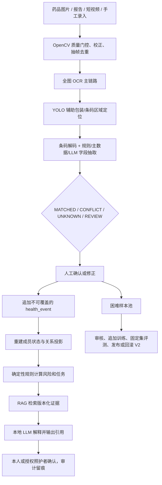
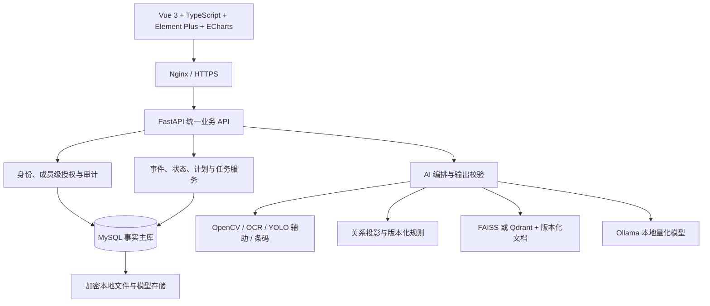

# 家健镜 HomeCare Twin

> 基于多模态视觉、家庭健康事件孪生与本地微调大模型的主动照护系统

面向 8 周软件工程实训的本地优先家庭居家照护项目。家健镜不替家庭成员看病，也不把“聊天机器人”或“定时闹钟”包装成创新；它持续记录家庭健康事实的变化，以多证据视觉录入为入口，通过确定性规则发现冲突、遗漏和风险，再用本地 RAG 与受约束大模型给出带证据的通俗解释和待确认任务。

> **产品硬承诺：** 健康数据默认不出网；药盒识别必须多渠道核对且支持人工修正；子女只能看到被精细授权的健康信息；提醒按等级和预算控制，不用低价值消息打扰家庭；AI 只能基于完整证据解释，不做诊断、处方或自主用药判断；产品只做居家照护，不提供买药、问诊和广告导流。蚂蚁阿福属于云端通用健康工具，家健镜不复制其服务生态。

> **当前状态：一期工程骨架已建立，完整 P0 业务仍在实现中。**
>
> 仓库当前包含 Vue/FastAPI/MySQL/Alembic 基础工程、家庭/成员/授权、手工确认事件、outbox、状态投影、测试和 CI。视觉、规则、RAG、Ollama、天气、完整页面和真实部署仍未交付；实际状态以[需求追踪矩阵](docs/vibe-coding/12-需求追踪矩阵.md)及可复现证据为准。

> **使用边界：教学演示，不用于诊断或治疗。**
>
> 系统不得诊断疾病、开具处方、决定停药或改变剂量。风险卡只提示“发现已知资料，需要进一步确认”。紧急情况应联系医生或当地急救服务。

## 核心价值

家庭中的药品、检查报告、过敏史、指标、计划和照护关系经常分散且不断变化。HomeCare Twin 将每次变化保存为不可覆盖的 `health_event`，再重建当前状态、重算规则并生成照护任务，因此能回答：

- 最近发生了什么变化；
- 哪些事实、规则和文档导致新风险；
- 当前结果是否经过本人或照护者确认；
- 下一步需要谁处理、何时升级。

这里的“孪生”是家庭健康运营型数字孪生，不模拟人体生理，也不宣称预测疾病。

## 六个 P0 功能域

| 功能域 | P0 交付 | 明确边界 |
|---|---|---|
| 家庭健康事件中心 | 成员、疾病、过敏、指标、药物、文档、授权与事件时间线 | 不接医院 HIS 和全量可穿戴设备 |
| 多证据视觉录入 | 图片/短视频质量检查、YOLO、OCR、条码、包装特征、本地主数据和人工复核/修正 | 不承诺识别任意药品，不做持续家庭监控；未知/冲突不得自动入库 |
| 家庭健康关系图谱 | 成员—疾病—过敏—药品—成分—计划—照护者关系投影 | P0 不引入大规模医学本体或自动医学推理 |
| 风险与环境规则 | 过期、临期、低库存、重复成分、过敏、有限相互作用、天气行动卡和四级提醒 | 不提供完整临床决策支持；普通告警有预算，严重告警不被压制 |
| 受约束计划优化 | 服药确认、延期、跳过、照护升级及安全时间窗内提醒建议 | AI 不得新增、停用、替换药物或改变剂量 |
| 本地证据助手与大屏 | SQL/图谱/RAG 工具调用、风险解释、事件摘要、业务与模型指标、字段级可见范围 | 无证据不作肯定性医学回答；无购药/问诊/广告入口 |

## 双闭环主链



视觉系统允许拒识。只有 `MATCHED` 且人工确认的药品可参与风险计算；LLM 不计算风险等级，只解释规则结果。

## 计划架构



前端和管理员端不得直连数据库、向量库或 Ollama。MySQL 是唯一业务事实源；图谱是可重建投影；规则给出确定结论；LLM 负责工具选择、引用和语言解释。家庭版网络出口默认拒绝，天气只可发送城市/区县代码，健康数据、报告、图片、视频、向量和对话不得自动上传。

## 技术基线

- Web：Vue 3、TypeScript、Vite、Element Plus、ECharts；
- API：Python 3.11、FastAPI、Pydantic、SQLAlchemy 2、Alembic；
- 数据：MySQL 8；向量检索在 P0 从 FAISS 起步，确需服务化时评审 Qdrant；
- 视觉：OpenCV 质量门控、PaddleOCR/本地 OCR、条码解析，YOLO11n 仅作包装/条码区域辅助；YOLO26n 仅作对照实验，是否采用由固定评估集决定；
- 大模型：LLaMA Factory 进行 4-bit QLoRA，Ollama 本地部署；模型学习工具调用、引用、解释和拒答，不学习并替代医学事实库；
- 测试：pytest、httpx、Playwright、固定视觉/LLM/安全评估集；
- 部署：Docker Compose，提供基础档、增强档和研发档。

以上是方案基线，具体依赖版本须由首个可运行工程增量锁定并更新文档。

## 8 周 P0 路线

| 周次 | 重点 | 可验收证据 |
|---|---|---|
| 1 | 范围、医疗边界、数据字典、标注规范、环境 | 评审记录、ADR、数据卡草案 |
| 2 | Vue/FastAPI/MySQL 骨架，成员、授权、事件模型 | 迁移、OpenAPI、权限测试 |
| 3 | 自采授权数据、图片/视频预处理、YOLO 辅助定位基线 | 数据集 V1、辅助模型 V1、评测报告 |
| 4 | OCR 主链路、条码解码、字段抽取、候选融合与人工复核 | 从拍照到确认的纵向闭环 |
| 5 | 时间线、关系投影、风险规则与告警预算 | 规则测试、风险证据链 |
| 6 | 计划确认、照护升级、天气行动卡、大屏 | 任务闭环与指标页面 |
| 7 | RAG、QLoRA 对照、Ollama 工具调用和安全回归 | 带引用回答、微调对照、安全报告 |
| 8 | 困难样本 V2、集成、部署演练、录屏与答辩 | V1/V2 对比、测试报告、交付包 |

若时间或算力不足，优先缩小药品 SKU、规则和页面范围，不删除授权、人工确认、拒识、证据和安全门禁。

## 当前仓库结构

```text
docs/vibe-coding/   需求、架构、数据、AI、测试、计划和交付基线
docs/stories/       当前可执行 Story、验收条件和复核要求
docs/decisions/     架构决策记录
docs/demo/          受控演示知识与场景
src/                Web、API、AI 模块和一期工程骨架
tests/              单元/集成起步测试，后续扩展 E2E、模型和安全测试
migrations/         MySQL/SQLite 兼容的 Alembic 版本化迁移
scripts/            Windows/Linux 启动、迁移和检查脚本
docker/             API/Web 镜像和 Nginx 配置
doc/                 历史会议记录、课程参考和 Office 模板
sync-test/           双仓库协作验证记录
```

## 开始工作

0. 任何成员、Vibe Coding 或 agent 必须先阅读[开发前必读与 Vibe Coding 工作流](docs/vibe-coding/开发前必读与Vibe%20Coding工作流.md)；agent 还必须遵守根目录的 [`AGENTS.md`](AGENTS.md)。
1. 再阅读[综合研究与实施报告](docs/家健镜%20HomeCare%20Twin%20综合研究与实施报告.md)、[文档导航](docs/vibe-coding/00-文档导航.md)和[需求规格](docs/vibe-coding/01-需求规格说明书.md)。
2. 按[产品信息架构与页面设计](docs/vibe-coding/18-产品信息架构与页面设计.md)冻结页面、状态和文案。
3. 从[需求追踪矩阵](docs/vibe-coding/12-需求追踪矩阵.md)领取尚未完成的需求。
4. 按[任务拆分与交付清单](docs/vibe-coding/15-任务拆分与交付清单.md)建立 Story，并遵守[贡献指南](CONTRIBUTING.md)。
5. 按[项目全生命周期开发流程](docs/vibe-coding/19-项目全生命周期开发流程.md)领取阶段 Issue、执行 Vibe Coding、PR、周验收和双仓库同步。
6. 只有在代码、测试和复现证据合并后，才把状态从“未开始/进行中”改为“已验证”。

本地基础启动命令已建立，完整 Demo 仍未完成。以[本地部署与 Demo 操作指南](docs/本地部署与Demo操作指南.md)为唯一入口；首次开发依次执行 `scripts/start.ps1 setup`、`scripts/start.ps1 up`、`scripts/start.ps1 health` 和 `scripts/start.ps1 down`，提交前执行 `scripts/start.ps1 check`。Linux/macOS 使用同名 `scripts/start.sh` 命令。
