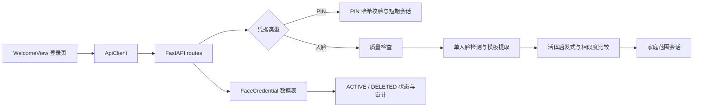

# 人脸识别功能现状与可优化内容报告

## 文档信息

| 项目 | 内容 |
|---|---|
| 评估日期 | 2026-08-22 |
| 评估基线 | `27d95dd fix: finalize household face login and credential deletion` |
| 评估范围 | 当前桌面 Web 端、FastAPI 本地 API、家庭级 PIN 与人脸凭证流程 |
| 移动端范围 | 不包含移动端实现、适配和验收 |
| 当前结论 | 已具备可运行的本地演示能力，不等同于生产级生物识别系统 |

## 一、结论摘要

当前功能已经贯通“家庭选择、身份选择、家庭 PIN 登录、人脸注册、人脸登录和凭证撤销”这条主流程。前端可以显示可访问家庭的名称，提交时仍使用系统家庭 ID；人脸注册只保存加密后的模板，不保存原始图片；凭证删除采用软删除并保留审计结果。最近一次删除失败的根因是历史 `DELETED` 记录与旧唯一索引冲突，已通过 `0016_hct424_face_credential_status_index` 将唯一约束收窄为仅针对 `ACTIVE` 记录，当前设计允许保留历史撤销记录。

但是，当前识别算法是 OpenCV Haar 检测器加 32×32 归一化灰度模板的本地实现，活体检测只是短序列运动启发式规则。项目尚未建立正式的人脸评测集、误识率/拒识率基线、抗攻击能力、设备兼容矩阵或生产密钥托管方案。因此，当前功能适合课程演示、开发联调和流程验证，不应作为唯一的高风险身份凭据，也不应直接用于医疗授权或其他不可逆业务决策。

## 二、当前已实现的能力

### 2.1 用户可见流程

1. 用户在登录页选择访问身份和访问用途。
2. 选择 PIN 或人脸登录时，前端按身份加载可访问家庭列表，优先显示家庭名称；列表不可用时允许手动输入家庭唯一 ID。
3. PIN 登录要求输入六位数字，并绑定到“家庭 + 当前身份”组合；设置页支持输入两次确认 PIN。
4. 人脸注册由家庭 Owner 管理，要求选择目标账号、上传 JPG/PNG、勾选明确同意，并使用 PIN 或账号密码进行二次确认。
5. 人脸登录先获取短期 challenge，再提交 2～3 帧图像；服务端检查图片质量、单人脸、活体启发式和模板相似度。
6. Owner 可以查看当前有效凭证的版本、算法版本和时间，并撤销凭证。撤销后立即失效，列表默认不显示 `DELETED` 记录。

### 2.2 服务端和数据层能力

- `auth.py` 提供账号密码、PIN challenge/verify、会话、challenge 消费和人脸失败限流等基础能力。
- `face_credentials.py` 提供人脸检测、模板提取、Fernet 加密/解密、余弦相似度和短序列活体检查。
- `routes.py` 提供注册、列表、删除、PIN 设置、PIN 登录、人脸 challenge 和人脸登录接口，并在敏感操作处执行家庭和 Owner 权限检查。
- `FaceCredential` 保存状态、凭证版本、算法版本、特征版本、同意版本和审计相关字段；不保存原始人脸图片、向量明文或相似度结果。
- 迁移 `0016_hct424_face_credential_status_index.py` 允许同一账号保留多条历史撤销记录，同时保证同一家庭和账号最多一条 `ACTIVE` 凭证。

## 三、实现数据流

注册和认证是两个不同流程：注册阶段处理同意、目标账号、图片质量和二次确认；认证阶段处理 challenge、失败限流、活体序列和匹配。任何后续优化都应保持这两个流程的策略、日志和验收指标分离。

## 四、实现证据与现状判定

| 功能 | 主要位置 | 现状 | 证据与说明 |
|---|---|---|---|
| 家庭名称选择 | [`src/web/src/views/WelcomeView.vue`](../../src/web/src/views/WelcomeView.vue) | 已实现 | 下拉项显示名称，提交仍使用家庭 ID；保留手动 ID 兜底。 |
| 六位家庭 PIN | [`src/api/app/auth.py`](../../src/api/app/auth.py)、[`src/api/app/routes.py`](../../src/api/app/routes.py) | 已实现，非持久化 | PIN 使用密码哈希保存并有 challenge/TTL；进程重启后内存状态会丢失。 |
| PIN 设置界面 | [`src/web/src/views/FaceCredentialView.vue`](../../src/web/src/views/FaceCredentialView.vue) | 已实现 | 当前身份和当前家庭分别绑定，可二次确认。 |
| 人脸模板提取 | [`src/api/app/face_credentials.py`](../../src/api/app/face_credentials.py) | 已实现，演示级 | OpenCV Haar + 灰度归一化 32×32 模板，算法版本为 `opencv-haar-grayscale-v1`。 |
| 注册质量门 | [`src/api/app/routes.py`](../../src/api/app/routes.py)、[`src/ai/vision/quality_gate.py`](../../src/ai/vision/quality_gate.py) | 已实现，但规则复用 | 注册和登录调用通用视觉质量门；现有阈值和提示词主要为药品/包装图片场景设计。 |
| 活体检查 | [`src/api/app/face_credentials.py`](../../src/api/app/face_credentials.py) | 已实现，启发式 | 只拒绝高度相同的重复帧，不能证明是真人，不能抵抗视频、屏幕或面具攻击。 |
| 人脸登录 | [`src/api/app/routes.py`](../../src/api/app/routes.py) | 已实现，需校准 | 有 challenge、失败限流、质量检查、相似度阈值和家庭范围会话。正式准确率尚无测量基线。 |
| 凭证删除 | [`src/api/app/routes.py`](../../src/api/app/routes.py)、[`migrations/versions/0016_hct424_face_credential_status_index.py`](../../migrations/versions/0016_hct424_face_credential_status_index.py) | 已修复并采用软删除 | 删除后清空加密模板、置为 `DELETED` 并记录审计；列表过滤已删除记录。 |
| 权限和二次确认 | [`src/api/app/routes.py`](../../src/api/app/routes.py) | 已实现基础边界 | 注册、PIN 设置和删除均有家庭范围/Owner 检查；开发身份请求头不得用于生产认证。 |
| 加密 | [`src/api/app/face_credentials.py`](../../src/api/app/face_credentials.py) | 已实现开发方案 | 使用 Fernet；部署未配置合法密钥时会派生本地回退密钥，生产必须禁止该回退。 |

## 五、安全、隐私与运维评估

### 已有控制

- 原始注册图片只在请求处理期间使用，持久化对象是加密模板。
- PIN 不进入 URL、响应体或审计内容；challenge 有动作、家庭、身份和过期时间绑定，并在消费后失效。
- 凭证删除不会误删家庭账号，保留状态和审计信息，符合可追溯要求。
- 前端在注册时展示明确同意项，服务端仍会重新校验同意、目标账号和确认凭据，不能只依赖浏览器校验。
- 人脸失败路径使用统一错误，配合失败计数和限流，降低枚举和暴力尝试风险。

### 需要正视的风险

1. **算法风险**：灰度模板对姿态、光照、摄像头和裁剪非常敏感；当前没有 FAR、FRR、ROC、阈值置信区间或不同人群的公平性结果。
2. **活体风险**：`motion-sequence-v1` 只是检测相邻帧差异，重复播放带动作的视频仍可能通过，不能宣称具备抗欺骗能力。
3. **密钥风险**：配置不正确时会使用开发回退派生密钥；密钥轮换、备份恢复、泄露处置和多实例一致性尚未形成部署方案。
4. **状态持久化风险**：PIN、challenge、失败计数和会话主要位于进程内存，服务重启或多副本部署会导致状态丢失或不一致。
5. **认证边界风险**：`X-Actor-Id` 等开发身份模式仅适合本地演示，必须在生产配置中关闭，并由真实身份提供方或受控设备凭据替代。
6. **隐私治理风险**：已有数据字典和删除传播规则，但尚缺面向用户的保存期限、撤回同意、导出、恢复不可用说明和自动清理策略。

## 六、已知问题、已修复问题与未完成事项

### 已修复

- **凭证删除失败**：旧的宽泛唯一索引将 `ACTIVE` 和历史 `DELETED` 记录一起约束，导致删除时触发数据库唯一约束异常。迁移 `0016` 改为仅对 `status = 'ACTIVE'` 建立部分唯一索引，删除接口现可完成软删除。
- **删除后页面状态不一致**：前端先从当前列表移除凭证，并将删除成功与刷新失败分开提示，避免把“删除成功、列表刷新失败”误报成删除失败。

### 尚未完成

- 人脸专用质量规则和质量数据集尚未从 HCT-202 药品图像质量门中拆分。
- 尚无正式活体/防伪供应商或经过评测的本地模型。
- 尚无生产级 PIN 重置、凭证恢复、设备更换和紧急撤销流程。
- 尚无真实浏览器摄像头端到端回归覆盖注册、登录、删除全链路；本报告不新增测试，也未在本次文档变更中重新执行测试。
- 桌面浏览器兼容、摄像头权限、低光/弱网和多实例部署的验收矩阵尚未建立。

## 七、可优化内容与优先级路线图

### P0：上线前必须完成

| 优化项 | 建议做法 | 验收标准 |
|---|---|---|
| 拆分人脸质量门 | 新建 face-specific 规则、阈值、错误码和样本夹具，移除药品/包装提示词耦合。 | 同一组人脸样本在注册和登录得到稳定、可解释的结果；质量错误可定位到亮度、清晰度、姿态或人脸数量。 |
| 持久化认证状态 | 将 PIN 哈希、challenge、会话、失败计数迁移到受控数据库或 Redis，并设计 TTL、并发消费和清理任务。 | 重启和双实例场景下状态语义一致；过期 challenge 不能重放。 |
| 关闭开发认证旁路 | 生产配置拒绝 `X-Actor-Id`，接入真实登录身份或受控服务间认证。 | 未提供正式身份凭据的请求统一返回未授权；开发模式只能在显式本地环境开启。 |
| 密钥托管与轮换 | 使用部署密钥管理服务注入 Fernet 密钥，增加密钥版本、轮换和旧模板迁移/失效策略。 | 配置缺失时启动失败而不是派生回退密钥；密钥不出日志、URL、响应和备份明文。 |

### P1：安全性和可用性增强

| 优化项 | 建议做法 | 验收标准 |
|---|---|---|
| 真实活体/防伪 | 评估平台能力或可信 SDK，保留 `FACE_LIVENESS_VERSION`，区分活体失败和匹配失败。 | 对照片、屏幕回放、视频回放和真人样本形成攻击测试集并达到约定通过率。 |
| 阈值与公平性校准 | 建立经过许可的评测集，按设备、光照、姿态和人群切分，记录 FAR/FRR、ROC 和置信区间。 | 发布阈值选择记录和回归基线，任何算法版本变更均能比较旧版本结果。 |
| 恢复和撤销 | 增加 Owner 管理的 PIN 重置、本人重新注册、设备丢失和紧急全量撤销流程。 | 恢复操作需要二次确认并写审计；撤销后已有会话和 challenge 均失效。 |
| 错误与观测 | 将质量、活体、匹配、依赖不可用分成稳定错误码；只记录结果和关联 ID，不记录图片/模板。 | 前端能给出可行动提示，运维可按错误码统计，不暴露生物特征或认证细节。 |

### P2：长期工程化

- 建立桌面浏览器和摄像头设备矩阵，覆盖权限拒绝、分辨率、光照、横竖屏和性能预算。
- 增加审计查询、保留期自动清理、模板版本迁移、备份恢复演练和删除传播监控。
- 提供无障碍的 PIN 替代路径和明确的非生物识别登录入口，避免人脸成为唯一可用方式。
- 为算法、质量规则、密钥和 API 合约建立版本登记、变更审批与回滚记录。

## 八、每项优化的通用交付门禁

任何后续 Story 或 PR 至少应附带：

1. 变更范围和数据分类，说明是否接触原始图片、模板、PIN 或认证日志。
2. 正常、失败、超时、重放、重启、多实例和权限越界场景的验收记录。
3. 数据库迁移的升级、回滚和已有 `DELETED` 历史记录验证。
4. 算法或质量规则变更的版本号、评测样本来源、指标对比和阈值选择依据。
5. 密钥、隐私、审计、错误提示和恢复流程的安全审查结论。

## 九、明确不在本报告范围内

- 移动端 App、移动端摄像头适配和移动端商店发布。
- 医疗诊断、处方、购药或自动医疗决策。
- 将人脸图像上传云端或接入云端人脸识别服务。
- 用人脸识别替代所有高风险操作的人工复核或其他身份凭据。

## 十、交付状态总览

| 状态 | 内容 |
|---|---|
| 已实现 | 桌面 Web 的家庭选择、六位 PIN、注册同意、二次确认、人脸模板注册、人脸 challenge 登录、凭证列表和软删除。 |
| 已修复 | 历史撤销记录导致凭证无法删除的数据库唯一索引问题；删除后前端状态处理问题。 |
| 待优化 | 人脸专用质量门、持久化认证状态、生产身份边界、密钥托管、真实活体、指标校准、恢复流程和设备矩阵。 |
| 需决策 | 是否允许人脸作为高风险操作的唯一凭据；采用哪种活体方案；评测数据的授权和保存期限；生产身份提供方与密钥管理方案。 |

## 参考资料

- [PIN 与人脸认证数据治理](../data-governance/05-PIN与人脸认证数据治理.md)
- [HCT-424 人脸凭证相关服务端实现](../../src/api/app/face_credentials.py)
- [认证与人脸凭证路由](../../src/api/app/routes.py)
- [前端登录页](../../src/web/src/views/WelcomeView.vue)
- [前端人脸凭证与 PIN 管理页](../../src/web/src/views/FaceCredentialView.vue)
- [历史撤销记录唯一索引迁移](../../migrations/versions/0016_hct424_face_credential_status_index.py)

