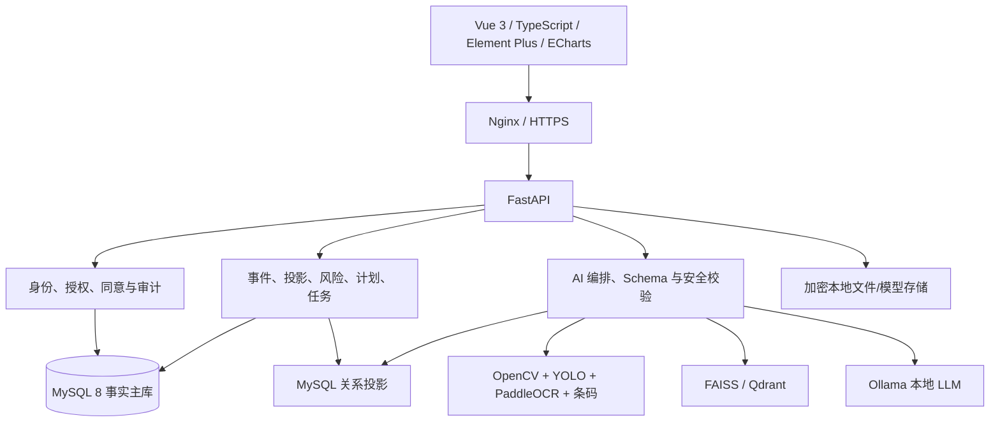

# HomeCare Twin 技术方案

> 状态：实现前基线。架构方向已按新方案统一，具体依赖版本、阈值和性能预算仍需用原型与 ADR 冻结。

## 1. 设计原则

1. **家庭事实、关系投影、确定规则、语言解释分层。** MySQL 保存事实；图谱可重建；规则计算风险；LLM 只调用工具和解释。
2. **事件追加写。** 修改健康状态产生新事件和补偿事件，不覆盖历史。
3. **开放集优先。** 视觉系统可以不知道；自动通过追求精确率，不追求覆盖率。
4. **证据契约。** 风险卡和助手回答绑定事实、规则、文档、确认状态及版本。
5. **本地优先、分档运行。** 无 LLM 时核心档案、规则、任务仍可用；训练与家庭运行分离。
6. **健康数据默认不出网。** 网络出口默认拒绝，天气仅传城市/区县代码；云端推理不作为家庭版默认回退。
7. **家庭协同最小授权。** 子女访问按成员、字段、动作、目的和期限校验，不默认共享全部健康档案。
8. **居家照护无商业导流。** API、页面和模型安全路由不得提供购药、问诊、广告或佣金入口。

## 2. 总体架构



所有 AI 请求先通过 FastAPI 的登录、成员授权、工具执行、规则计算、检索、结构校验和禁止内容检查。前端不直接访问模型服务。

## 3. 技术基线与退出条件

| 层 | 基线 | 退出/替代条件 |
|---|---|---|
| Web | Vue 3 + TypeScript + Vite + Element Plus + ECharts | 若脚手架或浏览器兼容失败，记录 ADR 后替代 |
| API | FastAPI + Pydantic + SQLAlchemy 2 + Alembic | 不允许第二业务服务直写数据库 |
| 事实库 | MySQL 8 | 课程部署无法稳定复现时再评审兼容方案 |
| 关系图 | MySQL 投影 + ECharts graph | P0 数据规模无需 Neo4j；复杂查询出现明确证据后再引入 |
| 向量检索 | FAISS 单机起步，Qdrant 服务化候选 | 必须支持文档/成员权限过滤、版本和备份 |
| 视觉 | OpenCV 质量门控、PaddleOCR/本地 OCR、条码解码器，YOLO11n 作为包装/条码区域辅助基线 | YOLO 只能辅助裁剪和定位；只有固定集证明有收益时才增加字段区域类别或替换模型 |
| LLM | 3B–7B 中文基础模型 + LLaMA Factory QLoRA + Ollama | 许可证、显存、工具准确率或安全不达标则缩小/更换 |

## 4. OCR 主链路与视觉辅助

家庭录入采用 OCR-first：用户主动摆放药盒并拍照，系统先完成质量门控和全图 OCR，保存每个文字框的原始值、区域和 OCR 置信度；YOLO 只辅助定位包装对象和条码区域，条码/二维码由专用解码器读取。YOLO 不把每个 SKU 当作类别，也不能覆盖 OCR 或条码原始证据。

P0 的 YOLO 类别控制为：`medicine_box`、`medicine_bottle`、`blister_pack`、`barcode_region`、`health_report`、`metric_table`、`medical_advice_region`。`drug_name_region`、`spec_region`、`expiry_region` 等字段区域可以作为辅助预标注或裁剪实验，但不是 OCR-first 发布模型的必需类别。药名、规格、厂家、批号和有效期的主要来源是 OCR 文本框及其字段角色解析。

标准处理顺序为：

```text
质量门控 → 全图 OCR → YOLO 包装/条码区域辅助 → 条码专用解码
→ 日期/单位/批号规则和本地词典 → 本地 LLM 字段结构化
→ OCR/条码/包装/主数据核对 → MATCHED / CONFLICT / UNKNOWN / REVIEW
→ 人工确认或修正 → health_event
```

LLM 在这里执行的是“语义解析/槽位填充”，不是像素级语义分割。LLM 只能在已有 OCR token、条码结果和主数据候选中选择字段，不得创造图片中不存在的文字或直接判定药品身份。字段证据格式以[HCT-201 OCR 字段提取契约](../data/HCT-201-OCR字段提取契约-V1.md)为准。

药品身份必须由 OCR、条码/二维码、包装类型、规格/厂家本地主数据和人工确认共同决定；不能由整盒图像分类器直接替代。

候选排序基线：

```text
candidate_score =
0.40 * OCR 文本一致度
+ 0.30 * 条码一致度
+ 0.15 * 包装类型一致度
+ 0.15 * 规格和厂家主数据一致度
```

该分数只排序已有候选，不能生成新的药品身份。条码与药名冲突、关键字段缺失、候选差距过小、未知 SKU 或图像质量不足时进入 `CONFLICT`/`UNKNOWN`/`REVIEW`。阈值必须用固定评估集校准并版本化。

视频每秒抽取 1–2 帧，质量过滤和感知哈希去重后跨帧聚合，保留文字最完整、模糊度最低、条码可解码的证据帧。

## 5. LLM、RAG 与工具链

模型微调目标是“如何工作”，包括意图/安全路由、工具选择、参数生成、证据引用、信息澄清、结构化输出和越权/医疗拒答。医学事实仍来自数据库、规则和版本化知识文档。

```text
用户问题
→ 登录与成员授权
→ 意图/风险路由
→ SQL、图谱、规则或 RAG 工具
→ 结构化证据上下文
→ Ollama 微调模型
→ Pydantic Schema 校验
→ 引用完整性与忠实性检查
→ 诊断/处方/停药/剂量内容检查
→ 回答 + 证据 + 规则/模型版本
```

建议训练集 3,000–6,000 条高质量样本；初始实验采用 4-bit QLoRA、rank 8/16、alpha 16/32、学习率 1e-4–2e-4、2–3 epoch、长度 1,024/2,048。参数不是承诺，最终由盲测工具准确率、引用忠实率、安全拒绝率和资源预算决定。

## 6. 规则与告警

规则引擎输入只能是已确认状态和版本化规则。输出包含 `risk_level`、`rule_id/version`、参与事实、证据引用、覆盖范围、去重键、有效期和推荐确认角色。一般/信息级风险应用成员每日预算；较高风险合并但不静默；严重风险不受预算压制。

天气规则只生成生活行动卡，不进入药物更改链路。

## 7. 可靠性与降级

| 故障 | 行为 |
|---|---|
| YOLO/OCR 不可用 | 保留任务，允许手工录入，明确显示未推理 |
| 证据冲突/未知 | 禁止正式入库和风险计算，转人工复核 |
| 向量库不可用 | 停止证据问答，不用模型常识补答 |
| Ollama 不可用 | 仍展示结构化事实、规则、引用和任务 |
| 天气接口失败 | 不生成新环境卡，不影响本地核心链路 |
| 投影异常 | 以事件/事实库重建，禁止反写错误投影 |

## 8. 数据和模型版本单元

一次可发布版本必须绑定：代码提交、MySQL 迁移、视觉模型与阈值、OCR/条码版本、主数据、规则集、知识文档/切片/Embedding、LLM 基础模型/LoRA/量化、提示词和输出 Schema。任一项变化都触发对应回归；发布后保留上一稳定组合。

## 9. P0 与扩展边界

P0 只建设 12–20 种药品 SKU、30–50 组有限审核规则、十个页面和一条连续故事线。国家追溯码仅做明确标注的本地模拟，不宣称接入监管系统。Neo4j、全量可穿戴、医院互联、复杂生理模拟和在线诊疗均为非目标。
