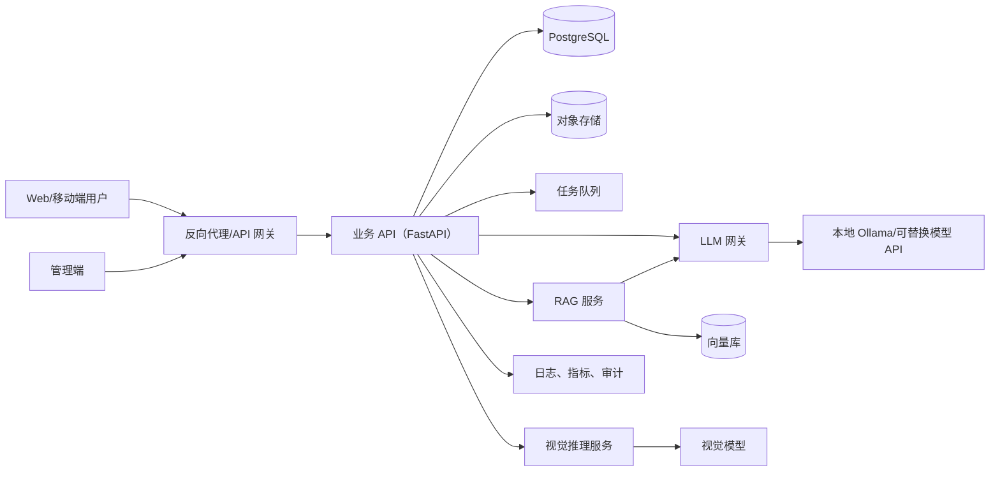

# 技术方案

## 1. 方案摘要

采用“模块化单体业务后台 + 独立 AI 推理服务”的渐进式架构。首版优先保证 8 周内可开发、可演示、可测试；当视频并发或模型资源成为瓶颈时，再按接口拆分服务。

## 2. 总体架构



## 3. 技术基线

| 层次 | 推荐基线 | 说明 |
|---|---|---|
| 前端 | Vue 3 + TypeScript + Vite | 组件化、类型安全、适合管理端 |
| 业务 API | Python 3.11 + FastAPI + Pydantic | 异步接口与 OpenAPI；统一代替双后端重复业务 |
| 管理后台候选 | Flask | 仅在课程必须展示 Flask 时作为独立管理界面，不与 FastAPI 共享 Session |
| ORM/迁移 | SQLAlchemy 2 + Alembic | 可测试、可迁移 |
| 业务数据库 | PostgreSQL | 本地可用 SQLite 做轻量开发，禁止作为共享生产库 |
| 向量检索 | ChromaDB（MVP）/Milvus（扩展） | 先满足单机演示，再评估规模化 |
| 对象存储 | MinIO 或本地兼容适配器 | 存放授权图片和文档 |
| 任务队列 | Redis + Celery/RQ | 文档解析、向量化、长耗时推理 |
| 视觉 | OpenCV + PyTorch + 经验证的 YOLO 模型 | 具体 YOLO 版本由数据与复现实验决定 |
| LLM | 统一模型网关 + Ollama/外部可替换提供方 | 屏蔽 DeepSeek/Llama 等模型差异 |
| RAG | 自有薄编排层，按需使用 LangChain | 关键检索、权限和引用逻辑不被框架隐藏 |
| 测试 | pytest、httpx、Playwright | 单元、接口和端到端 |
| 部署 | Docker Compose | 8 周实训可复现；后续再考虑 Kubernetes |

## 4. 核心流程

### 药物识别

上传校验 -> 病毒/格式检查 -> 脱敏与临时存储 -> 视觉推理 -> 阈值与类别校准 -> 药品基础库匹配 -> 返回候选、置信度、免责声明 -> 审计。

### RAG 问答

身份与权限校验 -> 风险意图检测 -> 查询改写 -> 按用户/知识域过滤检索 -> 重排 -> 构造带来源上下文 -> LLM 生成 -> 引用完整性校验 -> 安全后处理 -> 流式返回。

### 文档入库

上传授权确认 -> 格式/大小校验 -> 文本解析/OCR -> 去噪与切片 -> 敏感信息检测 -> 嵌入 -> 写入向量库 -> 抽样验收 -> 发布版本。

## 5. 关键设计决策

- FastAPI 作为唯一业务 API 入口，避免 Flask 与 FastAPI 各自实现认证和数据逻辑。
- 模型通过适配器调用，业务代码不绑定具体模型或云服务。
- 原始媒体与业务数据库分离；数据库只保存对象引用、摘要和权限元数据。
- AI 结果不可直接成为健康数据事实，需保存为“模型建议/候选”，人工确认后才可转为正式记录。
- 每次推理绑定 `request_id`、`model_version`、`prompt_version`、`knowledge_version`。
- RAG 权限过滤必须发生在检索前，不能在生成后再隐藏越权内容。

## 6. 降级与容错

- LLM 不可用：返回知识库搜索结果与明确故障提示，不生成回答。
- 向量库不可用：禁止无引用医疗回答，可切换到关键词检索。
- 视觉模型不确定：返回“无法可靠识别”和人工核对建议。
- 视频负载过高：降低抽帧率或转为单图模式，不能让业务 API 阻塞。
- 外部模型 API 不可用：本地模型可选降级；切换必须记录模型版本。

## 7. 实施阶段

1. 建立认证、数据模型、API 契约和开发环境。
2. 打通药物单图识别与基础库匹配。
3. 打通知识文档入库、可追溯检索与问答。
4. 增加多模态输入、视频演示、管理后台和审计。
5. 完成性能、安全、验收测试及部署交付。

## 8. 主要风险

| 风险 | 缓解措施 |
|---|---|
| 医疗回答误导 | 有限场景、引用、拒答、风险升级、人工复核 |
| 药品数据不足 | 先限定类别，建立未知类，报告每类指标 |
| GPU 资源不足 | 小模型、量化、异步任务、单图优先 |
| 隐私泄露 | 合成数据、最小化、隔离、加密、审计、自动清理 |
| 技术栈过多 | 固定基线，新增组件必须有 ADR 和替代方案 |

## 9. 首个开发增量

第一增量只建立可验证的业务骨架，不同时接入全部基础设施：

1. `GET /api/v1/health` 提供 API 存活检查和版本信息。
2. 建立统一配置、错误结构、请求 ID 和结构化日志。
3. 建立用户、家庭、成员、授权和审计的领域模型与迁移。
4. 完成登录、家庭成员 CRUD 和越权测试。
5. 以适配器模拟视觉/RAG 服务，先固定契约，再接真实模型。

完成条件：

- 本地和 CI 可以从干净环境运行；
- API 契约、数据库迁移和回滚路径明确；
- 单元、集成、越权和敏感信息测试通过；
- 尚未实现的 AI 能力返回明确的 `501` 或受控模拟结果，禁止伪装成功。

## 10. 模块接口基线

| 调用方 | 被调用方 | 方式 | 失败处理 |
|---|---|---|---|
| Web | 业务 API | HTTPS JSON/SSE | 展示统一错误和请求 ID |
| 业务 API | 视觉服务 | 版本化内部 HTTP/任务队列 | 超时、熔断、低置信度拒识别 |
| 业务 API | RAG 服务 | 版本化内部 HTTP/任务队列 | 无证据不生成确定性回答 |
| RAG | LLM 网关 | 统一适配器 | 模型不可用时只返回检索证据 |
| Worker | 对象/向量存储 | SDK 适配器 | 幂等重试并记录失败任务 |

任何跨模块接口都必须定义超时、重试、幂等、错误码和可观察指标。内部接口不等于可信接口，仍需验证调用身份和资源权限。

## 11. 关键版本绑定

一次可复现实验或回答至少绑定：

```text
code_commit
database_revision
model_name + model_version
dataset_or_knowledge_version
prompt_version
runtime_environment
request_id
```

缺少任一关键版本的 AI 输出不能作为正式评估证据。
