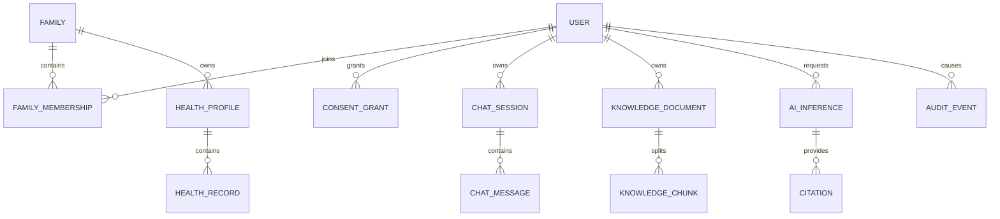

# 领域模型与数据库设计

## 1. 设计原则

- 业务数据与模型输出分离，模型候选不能直接成为已确认健康事实。
- 所有业务表使用不可猜测 ID、UTC 时间和明确的创建/更新主体。
- 家庭不是天然可信边界；访问成员资料仍需可撤销授权。
- L3/L4 数据加密保存，日志只记录脱敏标识和最小事件。
- 数据库变更只通过 Alembic 迁移，迁移包含前向策略和回滚说明。

## 2. 核心关系



## 3. 表设计基线

### 身份与家庭

| 表                   | 关键字段                                                                 | 约束                             |
| -------------------- | ------------------------------------------------------------------------ | -------------------------------- |
| `users`              | `id`、`email`、`password_hash`、`status`                                 | 邮箱规范化唯一；不保存明文密码   |
| `families`           | `id`、`name`、`created_by`                                               | 创建人不自动拥有所有健康数据权限 |
| `family_memberships` | `family_id`、`user_id`、`role`                                           | 复合唯一；角色最小化             |
| `health_profiles`    | `id`、`family_id`、`display_name`、`birth_year_range`                    | MVP 不采集身份证号和精确生日     |
| `consent_grants`     | `grantor_id`、`grantee_id`、`resource_scope`、`expires_at`、`revoked_at` | 授权可过期、可撤销、可审计       |

### 健康数据

| 表                      | 关键字段                                                 | 约束                       |
| ----------------------- | -------------------------------------------------------- | -------------------------- |
| `health_records`        | `profile_id`、`record_type`、`value_json`、`recorded_at` | 类型化校验；敏感值加密     |
| `allergies`             | `profile_id`、`substance`、`reaction`、`status`          | 用户确认与 AI 建议分离     |
| `medication_candidates` | `inference_id`、`drug_id`、`confidence`、`bbox_json`     | 只表示候选，不代表用药记录 |
| `drug_catalog`          | `id`、`generic_name`、`product_name`、`source_version`   | 来源可追溯，版本化发布     |

### 对话与知识

| 表                    | 关键字段                                                       | 约束                           |
| --------------------- | -------------------------------------------------------------- | ------------------------------ |
| `chat_sessions`       | `owner_id`、`title`、`retention_until`                         | 按所有者隔离                   |
| `chat_messages`       | `session_id`、`role`、`content_ref`、`safety_level`            | 大文本/图片使用对象引用        |
| `knowledge_documents` | `owner_id`、`scope`、`source_uri`、`version`、`status`         | 入库前授权，发布后不可原地覆盖 |
| `knowledge_chunks`    | `document_id`、`page`、`section`、`content_hash`、`vector_ref` | 记录定位与权限元数据           |
| `citations`           | `inference_id`、`chunk_id`、`quote_hash`、`rank`               | 引用必须指向实际检索证据       |

### AI 与审计

| 表               | 关键字段                                                                           | 约束                     |
| ---------------- | ---------------------------------------------------------------------------------- | ------------------------ |
| `ai_inferences`  | `request_id`、`owner_id`、`task_type`、`model_version`、`prompt_version`、`status` | 不在普通日志保存输入正文 |
| `model_registry` | `name`、`version`、`artifact_hash`、`metrics_json`、`status`                       | 版本唯一；发布需评审     |
| `async_tasks`    | `id`、`owner_id`、`task_type`、`status`、`retry_count`                             | 状态机和幂等键           |
| `audit_events`   | `actor_id`、`action`、`resource_type`、`resource_id_hash`、`result`                | 只追加，不保存敏感正文   |

## 4. 访问控制

一次资源访问同时判断：

1. 调用者身份和账号状态；
2. 角色是否允许该动作；
3. 资源所有者或家庭范围；
4. 是否存在有效、未撤销、未过期授权；
5. 字段级敏感度；
6. 操作是否需要二次认证。

前端隐藏按钮不是权限控制。RAG 检索必须把相同授权范围写入检索过滤条件。

## 5. 删除传播

用户删除请求按以下顺序执行并保持幂等：

```text
冻结新写入 -> 标记删除任务 -> 删除/匿名化业务记录
-> 删除对象 -> 删除向量与切片 -> 清除缓存
-> 处理派生数据 -> 写入不含正文的删除审计
```

失败步骤进入可重试任务，不得在只删除数据库行后返回“全部删除成功”。

## 6. 首批迁移顺序

1. 用户、家庭、成员关系与授权；
2. 健康档案与审计；
3. 异步任务与对象元数据；
4. 对话、知识文档与切片元数据；
5. 模型注册和推理追踪。

每批迁移先写权限与删除测试，再接页面或模型服务。

## 7. 启动前状态与首批决策

当前尚无业务迁移和已实现数据表。本文件中的实体、字段和关系都是设计草案，必须经过需求、
权限、隐私和删除传播评审后才能进入迁移。

首批需要确认：

1. 用户、家庭、成员、授权和审计是否足以支持首个纵向增量；
2. 访问令牌、刷新令牌、会话撤销和二次认证的具体策略；
3. `owner/caregiver/member/viewer` 的权限矩阵和最后一个 owner 保护规则；
4. PostgreSQL 与课程材料中 MySQL 的取舍及迁移成本；
5. SQLite 是否只限单元测试，如何避免数据库行为差异；
6. 敏感字段加密、密钥轮换、保留期和删除传播责任；
7. 哪些健康、对话和 AI 表推迟到权限与删除方案通过后再建立。

首个迁移 PR 必须包含正向迁移、回滚说明、空库测试、升级测试、权限测试和数据影响说明。
