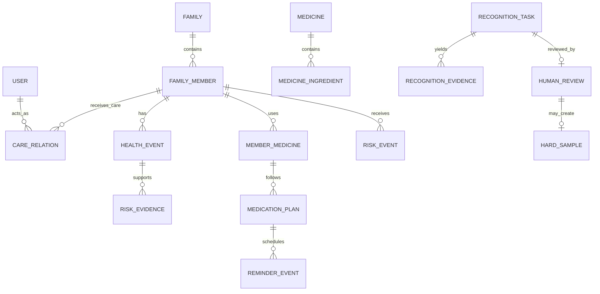

# HomeCare Twin 领域模型与数据库设计

## 1. 核心原则

- MySQL 8 是唯一事实主库；关系图和向量索引均为可重建派生物。
- `health_event` 追加写，保存变化而非只保存当前表单值。
- 当前状态投影便于查询，但每个字段可追溯到确认事件；`UNCONFIRMED` 事件不得更新该投影。
- 所有成员资源携带 `family_id` 与 `member_id`，访问同时校验角色和成员授权。
- 模型预测是证据，不是正式健康事实；人工确认后才进入状态。

## 2. 领域关系

## 3. 表设计基线

| 数据域 | 核心表 |
|---|---|
| 家庭权限 | `family`、`user`、`family_member`、`care_relation`、`consent_grant`、`access_audit` |
| 健康状态 | `condition`、`allergy`、`health_metric`、`medical_document`、`health_event` |
| 药品计划 | `medicine`、`medicine_ingredient`、`medicine_batch`、`member_medicine`、`medication_plan`、`reminder_event` |
| 图谱规则 | `knowledge_node`、`knowledge_edge`、`interaction_rule`、`environment_rule`、`risk_event`、`risk_evidence` |
| 模型任务 | `recognition_task`、`recognition_evidence`、`human_review`、`hard_sample`、`model_version` |
| LLM 知识 | `knowledge_document`、`knowledge_chunk`、`chat_message`、`tool_call_record`、`citation_record` |

最终可合并/拆分表，但不得丢失事件、确认、证据、授权和版本语义。

## 4. `health_event` 最小字段

`id`、`family_id`、`member_id`、`event_type`、`occurred_at`、`recorded_at`、`actor_user_id`、`source_type`、`source_id`、`before_snapshot`、`after_snapshot`、`evidence_ids`、`recognition_model_version`、`rule_version`、`correlation_id`、`causation_id`、`supersedes_event_id`、`schema_version`。

事件不可 UPDATE/DELETE；业务更正追加补偿事件。敏感快照应最小化并加密，避免复制整份报告。

## 5. 视觉与复核状态

`recognition_task` 记录任务类型、状态、输入文件引用、版本、阈值和耗时；`recognition_evidence` 保存帧/裁剪、框、OCR、条码、包装特征、候选和冲突；`human_review` 保存决定、原预测、修正字段、理由、操作者、时间和训练同意状态。确认事务同时追加事件并通过 created outbox 触发投影/规则更新；待确认事实只进入 pending outbox，不能触发正式投影，避免未确认结果进入健康状态。

## 6. 风险证据模型

`risk_event` 保存等级、规则版本、状态、去重键、有效期、预算决定和确认人；`risk_evidence` 分别引用 `FACT`、`RULE`、`DOCUMENT`、`CONFIRMATION`。LLM 文本不作为风险依据。

## 7. 授权、删除和审计

`consent_grant`/`access_policy` 至少包含授权人、被授权人、家庭/成员、数据域/字段、动作、目的、起止时间、是否允许风险升级和撤回状态。子女视图必须按字段过滤，不能只依赖前端隐藏。撤权需要传播到 API、缓存、向量索引、通知队列和可控备份。

`consent_grant` 限定成员、动作、目的与有效期。撤权后所有读写和照护升级实时校验；缓存不得延迟放行。删除使用任务表跟踪主库匿名化/删除、文件、知识块/向量、缓存和备份到期处置。审计保留最小证明，不保存完整敏感正文。

P0 当前映射为 `household`、`member`、`care_authorization` 和 `access_audit`：

- `household.created_by` 是当前单 Owner 身份事实字段；未来改为 `owner_id` 或多 Owner 必须走迁移和新 ADR。
- `care_authorization` 保存 `grantor_actor_id`、`grantee_actor_id`、家庭/成员、`data_fields`、`actions`、ASCII `purpose` 代码、有效期、撤权时间、`version` 和更新时间。
- 授权更新/撤权执行 `WHERE version = expected_version` 条件更新；冲突不产生覆盖。
- `access_audit` 保存授权生命周期和非 Owner 访问决定的最小元数据，不设置会随业务资源级联删除的授权外键，不包含健康正文或证据。
- 已存在审计记录时禁止降级删除审计表；应用回滚保持默认拒绝并保留审计，数据库使用前滚修复。

## 8. 迁移顺序

1. 用户、家庭、成员、授权和审计；
2. 事件、outbox 和当前状态投影；
3. 药品主数据、批次、成员用药和计划；
4. 识别任务、证据、人工复核和困难样本；
5. 规则、风险、关系投影；
6. 文档、切片、工具调用和引用。

每次迁移验证空库升级、已有数据升级、回滚/前滚策略、索引、外键和删除传播。
