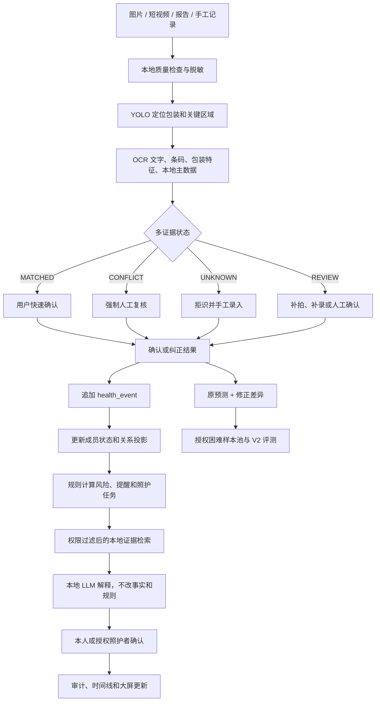
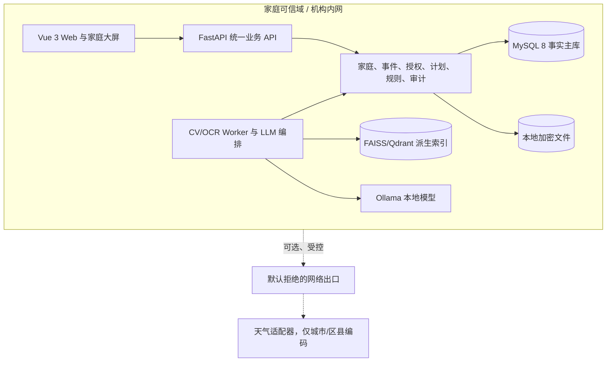

# 家健镜 HomeCare Twin 综合研究与实施报告

> 版本：V1.0
>
> 日期：2026-08-03
>
> 文档性质：五份研究报告的整合决策稿，也是仓库产品、架构、实施和验收文档的上位基线。
>
> 适用范围：8 周软件工程实训 P0 教学原型；不用于诊断、治疗或替代医生/药师判断。

## 1. 执行摘要

家健镜 HomeCare Twin 应被定义为一套**本地优先、事件驱动、证据可验证、家庭协同的居家照护系统**。它不做在线问诊、买药导购、广告推荐或自动分药硬件，也不把“拍照识药”和“AI 问答”单独包装成核心创新。

系统真正要解决的问题是：

> 家庭最近发生了哪些健康变化？这些变化触发了什么待处理风险？依据是什么？子女或其他照护者能看哪些信息？提醒怎样不扰民？处理之后是否形成闭环？

五份研究报告的共识可以收敛为一条主链：

```text
图片 / 短视频 / 健康文档 / 手工记录
-> 本地质量检查与多渠道识别
-> 证据融合与人工确认/修正
-> 追加 health_event
-> 更新成员状态与家庭关系投影
-> 确定性规则计算风险与提醒等级
-> 权限过滤后的本地文档检索
-> 本地大模型解释证据
-> 本人或被授权照护者确认行动
-> 审计留痕与困难样本回流
```

本次整合新增并固化六项产品硬承诺：

1. **健康数据默认不出网。** 家庭版的成员档案、疾病、过敏、用药、报告、图片、视频、向量、对话和模型输入均留在家庭可信域；网络出口默认拒绝。天气只允许发送城市/区县代码，且不是核心链路依赖。
2. **药盒录入采用 OCR-first 并进行多渠道核对。** 用户主动摆放药盒并拍照后，OCR 读取整张图片文字，YOLO 只辅助定位包装/条码区域，条码/二维码由专用解码器提供码值，包装特征和本地主数据共同校验；冲突、未知或低质量结果进入人工复核，错误允许人工修正且保留原预测。
3. **子女查看权限细到数据类型和操作。** “子女是照护者”不等于“默认能看全部病史”。授权必须可限定成员、字段、动作、用途、有效期和升级条件，撤权立即生效。
4. **提醒分级并有告警预算。** INFO、GENERAL、HIGH、URGENT 分层；普通提示合并、摘要化和限量，严重事件不被预算压制，减少提醒疲劳。
5. **AI 只解释有依据的结果。** 风险等级由版本化规则决定，LLM 只能调用权限范围内的事实、规则和文档并进行通俗解释；没有依据就澄清或拒答，不给出诊断、处方、停药、换药或剂量结论。
6. **只做居家照护。** 产品不放买药入口、药品佣金、问诊转化、广告推荐或与照护无关的健康消费导流。蚂蚁阿福等云端通用健康工具可以做竞品参照，但不是家健镜的产品边界。

## 2. 研究结论与决策收敛

### 2.1 五份报告各自贡献

| 输入报告 | 主要贡献 | 本报告采用的决策 |
|---|---|---|
| 全面调研、竞品分析与差异化创新报告 | 用户、市场、竞品、差异化方向和商业边界 | 从“健康问答/提醒”转向“家庭健康事件与照护任务” |
| 完整系统架构与技术实施方案 | 本地可信域、信任边界、数据流、组件职责和实施细节 | 家庭版默认本地闭环，云端不作为默认依赖 |
| 系统架构与技术栈设计研究报告 | MVP 与生产演进、模块边界、数据契约、部署档位 | 模块化单体 + 独立 AI 工作进程，MySQL 为唯一事实源 |
| 最终集成项目研究报告 | 功能域、训练/部署/验收和答辩交付物 | 以可演示纵向闭环为验收，不以功能数量为验收 |
| 家庭健康事件孪生与本地智能照护平台最终研究及实施方案 | 综合落地基线、优先级、风险与建议范围 | P0 必做闭环与增强功能分层，明确不做临床决策 |

### 2.2 冲突项的统一处理

| 议题 | 报告中存在的不同侧重点 | 统一决策 |
|---|---|---|
| 周期 | 有 8 周、10 周、12 周原型建议 | 仓库按 8 周 P0 执行；10/12 周内容作为扩展，不挤占安全闭环 |
| 视觉模型 | OCR-first，YOLO11n 包装/条码辅助与 YOLO26n 对照 | OCR 是 P0 主线；YOLO11n 只做辅助定位，YOLO26n 只做同数据同硬件对照，不能替代 OCR |
| 向量库 | FAISS 轻量与 Qdrant 服务化两条路线 | 基础档可用 FAISS；增强档优先 Qdrant；二者都是可重建派生物 |
| 图谱 | MySQL 关系投影与可选 Neo4j | MySQL 为事实源；Neo4j 只能作为可删除、可重建的只读投影 |
| 推理部署 | Ollama 本地与 PAI-EAS 机构扩展 | 家庭版默认 Ollama/模板降级；EAS 仅为明确授权的机构扩展 |
| 天气 | 作为增强功能或低风险场景 | 不进入医疗判断，只生成低风险生活行动卡，网络失败不影响核心照护 |

## 3. 产品定位、用户与边界

### 3.1 产品定义

家健镜通过图片、短视频、健康报告、处方/出院记录和手工记录感知家庭健康变化，以 MySQL 保存已确认事实，以事件时间线保存变化，以关系投影组织成员、疾病、过敏、药品、计划、环境和照护者关系，以规则引擎判断已知风险，以本地 RAG 和受约束 LLM 解释依据，帮助本人和授权照护者完成居家任务。

这里的“孪生”是**家庭健康运营型数字孪生**，不模拟人体生理，不宣称预测疾病，也不把模型猜测当作健康事实。

### 3.2 首批用户

| 用户 | 主要痛点 | 家健镜价值 |
|---|---|---|
| 异地照护子女 | 不清楚父母最近新增了什么、哪些任务未处理 | 变化时间线、字段级授权、分级升级 |
| 多药管理家庭 | 商品名、成分、批次、库存和医嘱容易混淆 | 多证据核验、人工修正、规则证据卡 |
| 出院/术后家庭 | 新旧医嘱和报告分散，计划容易混用 | 医嘱版本对比、待确认任务、来源追溯 |
| 儿童/过敏成员家庭 | 过敏、药品、环境关注点分散 | 过敏关系、低风险环境卡、最小共享 |
| 社区/机构照护团队 | 需要在授权内协同，不能无边界看家庭数据 | 机构内网档位、审计、成员级 ABAC |

### 3.3 非目标

- 在线问诊、挂号、购药、药品商城、佣金链接和广告推荐；
- AI 诊断、自动处方、自动停药/换药/加减剂量；
- 未经确认的识别结果直接参与药物风险计算；
- 持续家庭摄像头监控、人脸识别作为唯一身份入口；
- 声称覆盖全部药品、全部相互作用或改善疾病结局；
- 家庭端自动训练和自动发布模型。

## 4. 竞品与差异化

### 4.1 竞品判断

蚂蚁阿福代表的是**云端通用健康工具**，公开能力集中在健康问答、报告/药盒图片理解、健康档案及医疗服务连接。它的产品逻辑是通用健康服务入口，家健镜不应与其比较问答广度、医生资源或服务生态。

其他健康平台、穿戴生态、服药提醒应用和智能药盒已经普遍具备健康档案、提醒、家属通知、药品扫描、趋势图或硬件分药等能力。这些功能可以作为家健镜的基础能力，但不能单独作为创新卖点。

### 4.2 家健镜的差异化组合

| 差异化能力 | 用户可感知的承诺 | 技术/治理落点 |
|---|---|---|
| 本地健康数据主权 | 健康资料默认不传网上 | 本地可信域、默认拒绝网络出口、云端路径单独部署 |
| 多渠道药盒核验 | 不确定就让人看，认错可以改 | YOLO + OCR + 条码 + 包装特征 + 主数据 + 人工复核 |
| 家庭健康事件孪生 | 能回答“最近发生了什么” | 追加事件、状态投影、事件时间线 |
| 子女细粒度授权 | 子女只看被允许的健康信息 | 成员/字段/动作/目的/期限/升级条件授权 |
| 不扰民提醒 | 普通提示合并、限量，严重事项不漏 | 四级严重度、去重键、每日预算和升级策略 |
| 证据型 AI | 每条判断都能展开来源和依据 | 事实 + 规则 + 文档 + 确认状态 + 版本的证据契约 |
| 居家照护边界 | 没有买药、问诊和广告导流 | 产品信息架构不设置交易/问诊入口，PR 阻断检查 |
| 双闭环学习 | 纠错不是“被吞掉”，而是可审计地改进 | human_review、hard_sample、训练授权、V1/V2 门禁 |

## 5. 核心业务闭环



关键门禁：只有 `CONFIRMED` 或 `CORRECTED` 才能创建正式健康事件；`CONFLICT`、`UNKNOWN`、`REVIEW` 不得参与药品风险计算。

## 6. 功能设计

### 6.1 本地优先与网络出口

家庭版默认启动以下本地服务：Web、FastAPI、MySQL、规则引擎、文件存储、视觉/OCR worker、可选向量库和 Ollama。健康数据、模型输入和对话上下文不得自动发送到互联网。

网络策略采用“默认拒绝、显式允许、逐次审计”：

| 出口 | 默认状态 | 允许内容 |
|---|---|---|
| 天气 | 可选 | 城市/区县代码；不带家庭地址、成员 ID、疾病、药品和报告 |
| 知识包更新 | 关闭或由管理员手动开启 | 签名、版本化、公开或已授权文档包 |
| 云端 LLM | 家庭版关闭 | 只在机构扩展中按单独授权、脱敏和审计启用 |
| 诊疗/购药/广告服务 | 永久禁止 | 无此业务出口 |

断网时，档案、事件、计划、提醒、规则、历史风险、授权和应急卡仍可用；天气停止更新，本地助手退化为结构化事实/规则卡，不生成无依据自由文本。

### 6.2 药盒多渠道核对与人工修正

识别链路至少保存以下证据：

- OCR：药名、规格、厂家、批号、生产日期、有效期的原始文字、来源框和 OCR 版本；
- YOLO：药盒、药瓶、药板和条码区域的辅助框；字段区域只作为可选裁剪辅助；
- 条码/二维码：专用解码器产生的码值、码制、解码质量和来源；OCR 仅作码值兜底；
- 包装特征：颜色、版式、局部视觉特征和相似候选；
- 本地主数据：药品候选、成分、规格、厂家、批次和有效期格式；
- 人工意见：确认、纠正、拒绝、理由码和是否同意训练。

每个字段还必须记录原始值、来源区域、系统计算置信度和各阶段模型版本。LLM 只在已有 OCR token、条码结果和主数据候选中做字段语义解析/规范化，不得生成图片中不存在的文字或直接宣称药品身份。

四态结果：

| 状态 | 条件 | 后续动作 |
|---|---|---|
| MATCHED | 证据一致、质量足够、候选明确 | 展示证据，要求一键确认 |
| CONFLICT | 条码、OCR、规格、包装或主数据冲突 | 禁止入库，强制人工复核 |
| UNKNOWN | 无候选或开放集相似度低 | 明确拒识，手工录入或补拍 |
| REVIEW | 模糊、反光、日期缺失、字段不足 | 补拍、补录或人工确认 |

人工修正不覆盖原始识别结果。系统新建 `human_review`，保存 `before`、`after`、原因、操作者、时间、模型版本和训练同意状态。训练同意与产品使用同意分开；没有明确训练同意的纠错不能进入困难样本池。

### 6.3 子女可见范围与家庭同意账本

权限不是简单的“能看/不能看”，而是以下六个维度的组合：

```text
被授权人 + 家庭/成员 + 数据域/字段 + 动作 + 使用目的 + 起止时间
```

推荐可授权数据域：

| 数据域 | 示例字段 | 默认给子女 |
|---|---|---:|
| 任务摘要 | 今日提醒、未确认任务、升级状态 | 否，需本人授权 |
| 用药摘要 | 药名、计划时间、确认状态、库存趋势 | 否，按字段授权 |
| 风险摘要 | 风险等级、标题、处理状态 | 否，按风险等级授权 |
| 疾病/过敏 | 诊断记录、过敏史和详细说明 | 否，默认不开放 |
| 文档正文 | 报告、处方、出院记录和图片 | 否，单独授权且可设置只读 |
| 对话记录 | 助手问题、回答和引用 | 否，默认不开放 |
| 审计与授权 | 谁看过、谁改过、授权变更 | 仅本人/管理员或按规则开放 |

每次访问都校验角色上限、成员授权、目的、有效期和字段范围；前端隐藏不是权限，API 必须返回字段过滤后的结果。撤权后立即阻止新访问、照护升级、缓存和索引读取，并保留最小审计证明。

### 6.4 分级提醒与告警预算

| 等级 | 例子 | 展示与通知 |
|---|---|---|
| INFO | 低库存趋势、一般天气提示、知识补充 | 详情页或每日摘要，不主动打扰 |
| GENERAL | 临期、待确认、材料待补 | 合并卡片，每日限量，支持免打扰时段 |
| HIGH | 连续未确认、过敏命中、重要规则冲突 | 单独通知本人或有效授权照护者 |
| URGENT | 用户主动记录的紧急模板或严重规则事件 | 不受普通预算限制，停止自由生成，明确求助 |

普通告警采用成员、规则类型、时间窗和去重键控制；同一天气事件 24 小时只生成一张行动卡；同类一般提醒每日最多三条作为 P0 默认值，实际阈值须在测试中冻结。任何预算都不能压制 HIGH/URGENT，也不能改变医嘱剂量或频次。

### 6.5 证据型 AI 与用药安全

LLM 只做：意图识别、工具选择、事实摘要、规则解释、文档引用、信息澄清和安全拒答。风险等级和告警预算由规则引擎独占决定权。

每条回答或风险卡必须可展开：

```json
{
  "answer": "通俗解释，不超过证据范围",
  "route": "EVIDENCE_REQUIRED",
  "facts": [{"fact_id": "...", "event_id": "...", "confirmed": true}],
  "rules": [{"rule_id": "...", "version": "...", "level": "HIGH"}],
  "citations": [{"document_id": "...", "version": "...", "chunk_id": "..."}],
  "actions": [{"type": "REVIEW", "assignee_role": "MEMBER"}],
  "model_version": "...",
  "knowledge_version": "..."
}
```

必须拒绝或升级：诊断请求、处方请求、停药/换药请求、个体剂量调整请求和无证据的肯定性用药判断。安全表达应是“发现已知资料/规则命中，请本人携带当前药单咨询医生或药师”，而不是“可以一起吃”或“必须停药”。

## 7. 系统架构与技术栈



### 7.1 组件决策

| 层 | P0 选择 | 约束 |
|---|---|---|
| 前端 | Vue 3、TypeScript、Vite、Element Plus、ECharts | 不直连数据库、向量库或模型 |
| 后端 | FastAPI、Pydantic、SQLAlchemy、Alembic | 统一鉴权、事务、证据校验和模型调用 |
| 数据库 | MySQL 8 | 唯一业务事实源，事件追加写 |
| 异步任务 | Redis + Celery 或 RQ | CV、OCR、文档解析和向量化异步化 |
| 媒体 | OpenCV、FFmpeg | 质量门控、校正、抽帧、去重 |
| 视觉 | OCR-first，YOLO11n 包装/条码辅助，YOLO26n 对照 | OCR、条码和辅助模型版本、哈希、评估和回滚齐全 |
| OCR/条码 | PaddleOCR、zxing-cpp/pyzbar | 保存原始证据和字段来源 |
| RAG | FAISS 基础档，Qdrant 增强档 | 检索前强制权限和版本过滤 |
| 微调 | LLaMA Factory、LoRA/QLoRA | 训练工具调用、引用、拒答，不记忆家庭事实 |
| 部署 | Docker Compose 分档 | 基础档不依赖 LLM，增强档增加本地 RAG/LLM |

### 7.2 数据责任分层

| 层 | 权威写入者 | 不允许做的事 |
|---|---|---|
| 家庭事实 | 业务后端与本人/授权用户确认 | 不保存模型猜测，不覆盖历史 |
| 关系投影 | 投影器 | 不成为第二事实源 |
| 风险决策 | 版本化规则引擎 | 不让 LLM 修改等级 |
| 文档证据 | 权限过滤后的 RAG | 不检索未授权正文 |
| 语言解释 | 本地 LLM + 后端校验 | 不直接写库，不做诊疗决策 |

## 8. 领域模型与接口基线

### 8.1 核心数据对象

```text
family / user / family_member / consent_grant / access_policy / access_audit
condition / allergy / health_metric / medical_document / health_event
medicine / ingredient / medicine_batch / member_medicine / medication_plan
recognition_task / recognition_evidence / human_review / hard_sample
rule_version / risk_event / risk_evidence / knowledge_document / document_chunk
chat_message / tool_call_record / citation_record / model_version
```

`health_event` 至少保存：事件类型、成员、前后状态、来源、操作者、确认状态、事件时间、证据引用、授权依据、模型/OCR/规则/知识版本。当前状态和图谱均可由事件重放恢复。

### 8.2 关键接口

| 方法 | 路径 | 重点 |
|---|---|---|
| POST | `/vision/jobs/image`、`/vision/jobs/video` | 创建本地识别任务 |
| GET | `/vision/jobs/{id}` | 返回证据、候选、四态和版本 |
| POST | `/recognitions/{id}/review` | 确认、纠正、拒绝并写入 human_review |
| POST | `/consents` | 创建成员/字段/动作/目的/期限授权 |
| GET | `/members/{id}/visibility` | 返回当前调用者可见字段集合 |
| POST | `/consents/{id}/revoke` | 立即撤权并触发清理任务 |
| GET | `/members/{id}/timeline` | 查询变化与证据时间线 |
| POST | `/risks/evaluate` | 以规则版本重算风险 |
| POST | `/plans/{id}/optimize` | 只生成安全时间窗内提醒建议 |
| POST | `/assistant/chat` | 受约束本地助手，返回证据契约 |
| GET | `/dashboard/family` | 家庭大屏，按权限过滤 |

所有成员资源执行 RBAC + 成员级 ABAC + 字段级过滤；所有写操作支持请求 ID、幂等键和审计。

## 9. 产品信息架构与页面设计原则

首页不采用“AI 对话框 + 功能宫格 + 购药入口”的通用健康 App 结构，而采用以下四区：

1. **近期变化：** 新增药品、报告、医嘱、权限和计划事件；
2. **待确认风险：** 只展示规则命中、等级、依据和处理状态；
3. **今日照护任务：** 分级提醒、确认/延期/跳过和升级对象；
4. **证据与授权状态：** 识别证据、人工修正、谁可以看到什么、模型/规则/知识版本。

P0 页面分为十页：家庭总览、成员健康档案、视觉扫描中心、人工复核中心、家庭健康图谱、用药安全中心、健康计划中心、本地健康助手、家庭健康大屏、模型实验室。页面信息结构、交互状态和验收文案见[产品信息架构与页面设计](vibe-coding/18-产品信息架构与页面设计.md)。

设计硬规则：

- 默认先展示本地隐私状态，明确“健康数据不出家庭可信域”；
- 任何识别结论旁边必须有“证据”“人工确认状态”“修正”入口；
- 任何子女视图旁边必须有“可见范围”和授权到期时间；
- 提醒显示等级、原因和下一步，不只用颜色或弹窗；
- AI 回答先显示依据，再显示解释；没有依据时显示信息不足；
- 不出现买药、问诊、广告、医疗服务导流入口；
- 所有高风险内容显示“教学演示，不替代医疗诊断/药师判断”。

## 10. 实施计划与交付物

### 10.1 8 周 P0

| 周 | 重点 | 关键交付 |
|---:|---|---|
| 1 | 范围、隐私和数据契约 | 需求、ADR、数据卡、网络出口策略、页面原型 |
| 2 | 事实与授权骨架 | 家庭/成员/字段授权、事件、审计、迁移和 API |
| 3 | 视觉 V1 | 授权数据、OpenCV、图片/视频预处理、YOLO11n 辅助定位 |
| 4 | 多证据复核 | OCR 主链路、条码解码、字段抽取、四态融合、人工修正、困难样本门禁 |
| 5 | 状态与风险 | 时间线、图谱投影、规则、四级提醒和告警预算 |
| 6 | 照护协同与大屏 | 计划确认、子女可见范围、升级、家庭大屏 |
| 7 | 本地助手 | 权限过滤 RAG、QLoRA 对照、Ollama、证据校验、拒答 |
| 8 | 集成与答辩 | V1/V2、断网演示、越权/无证据/危险请求回归、交付包 |

### 10.2 缩范围顺序

时间或算力不足时依次削减：复杂图谱查询、天气高级规则、医嘱版本增强、SKU 数量、规则数量和 LLM 训练规模。

不得削减：本地默认不出网、成员/字段授权、人工复核、未知/冲突拒识、事件追加写、确定性规则、证据引用、分级提醒、安全拒答、固定集和回滚。

### 10.3 交付物

- 产品综合报告、需求规格、页面信息架构和数据字典；
- FastAPI/OpenAPI、MySQL 迁移、事件/授权/审计实现；
- OCR 字段证据契约、YOLO 辅助/OCR 数据卡、模型卡、四态识别和 V1/V2 报告；
- 规则集、证据文档、RAG 引用校验和 LLM 安全评估；
- 本地基础档/增强档部署包、断网演示和恢复说明；
- 测试报告、越权/撤权/删除/出口阻断/告警预算证据、答辩录屏。

## 11. 验收指标与发布阻断

### 11.1 P0 目标

| 类别 | 指标 |
|---|---|
| 视觉 | 药品包装 Recall >= 95%，自动通过精确率 >= 99%，未知转人工率 >= 95% |
| 多证据 | 识别状态、字段来源、冲突原因和人工修正完整率 100% |
| 权限 | 跨家庭/跨成员越权拒绝率 100%，撤权立即生效 |
| 提醒 | 普通告警预算执行率 100%，重复合并率 >= 90%，严重事件不被压制 |
| AI | 引用存在率 100%，无证据拒答率 >= 95%，危险用药请求拒绝率 >= 98% |
| 事件 | 事件追加写、重放恢复、补偿更正和审计完整率 100% |
| 隐私 | 默认无健康数据网络出口；日志不含健康正文、密钥或完整上下文 |
| 性能 | CPU 单图全流程 P95 <= 8 秒，具体硬件和样本量必须报告 |

### 11.2 发布阻断

出现以下任一情况不得发布或答辩标记为“已验证”：

- 未确认药品进入风险计算；
- 条码/OCR/包装冲突被系统强行选定；
- 子女越权读取疾病、过敏、报告或对话；
- 撤权后仍能访问缓存、索引或接收升级通知；
- 普通提醒刷屏或 HIGH/URGENT 被预算压制；
- LLM 无依据给出停药、换药、剂量或诊断结论；
- 健康数据、原始报告、提示词或密钥进入日志或互联网；
- 出现购药、问诊、广告或与照护无关的导流；
- 模型、规则、知识或数据不可回滚、不可复现或授权不明。

## 12. 最终结论

家健镜最可行的产品路径不是与蚂蚁阿福等云端通用健康工具比“谁更会回答健康问题”，而是建立家庭自己的本地事实、变化、证据、权限和照护闭环。

最终推荐基线：

```text
本地可信域优先
+ 多渠道药盒核验与人工修正
+ 家庭健康事件孪生
+ 字段级子女授权
+ 分级提醒与告警预算
+ 规则决定风险、LLM 解释证据
+ 只做居家照护，不做购药/问诊/广告
```

只要这条主线稳定贯通，家健镜就具备清晰的教学价值、可验证的技术创新和后续面向社区/机构照护扩展的产品基础。

## 附录 A：输入材料

本报告综合以下五份用户提供的 PDF：

1. 家健镜 HomeCare Twin 全面调研、竞品分析与差异化创新报告；
2. 家健镜 HomeCare Twin 完整系统架构与技术实施方案；
3. 家健镜 HomeCare Twin 系统架构与技术栈设计研究报告；
4. 家健镜 HomeCare Twin 最终集成项目研究报告；
5. 家健镜 HomeCare Twin：家庭健康事件孪生与本地智能照护平台最终研究及实施方案。
